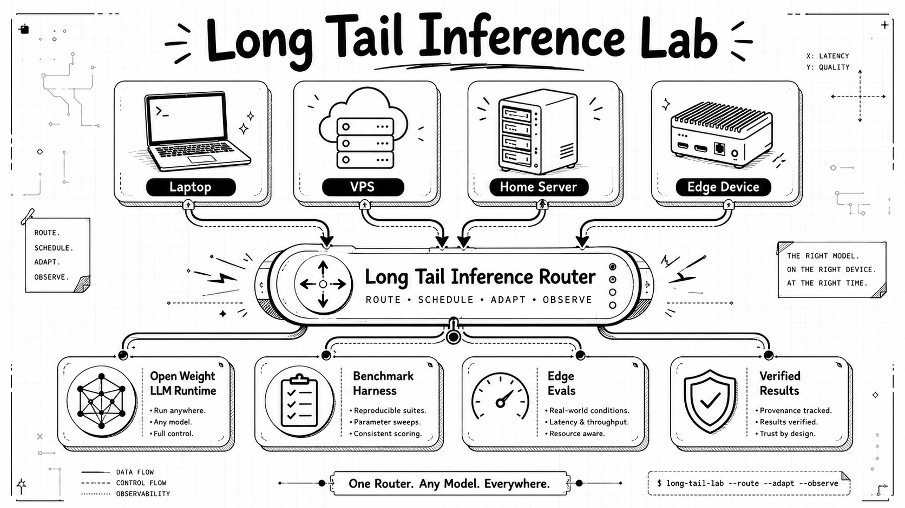

<p align="center">
  
</p>

# Long Tail Inference Lab

A research lab for testing whether verified terminal work can become reusable local intelligence.

## Thesis

A lightweight local model does not need to know everything to become useful. It may need access to the right evidence from work that has already been completed and verified.

Lily studies whether terminal artifacts can be transformed into durable memory that raises local task success over time. The model stays fixed during the core experiment. The memory grows. Executable tests decide whether capability actually improves.

## Active experiment

### [01 Terminal Artifact Memory](projects/01_terminal_artifact_memory/README.md)

**Status:** Specified

**Question:** Can verified artifacts from completed terminal benchmark tasks make a fixed lightweight local model increasingly useful on recurring engineering problems?

The experiment runs terminal tasks, preserves privacy safe evidence, distills that evidence into a human readable Markdown wiki, and measures local model performance at successive memory checkpoints.

## How the lab arrived here

Two earlier specifications explored the pieces separately:

1. [Memory Wiki](archives/experiments/01_memory_wiki/README.md) explored durable knowledge, retrieval, routing regret, and reviewed write back.
2. [Session Capsule Analysis](archives/experiments/02_session_capsule_analysis/README.md) explored privacy safe artifact collection and measurement before systems design.

They were archived before execution because the new experiment provides a clearer workload, a stronger verifier, and one integrated learning curve. No empirical results were discarded.

## PARA organization

```text
projects/
  01_terminal_artifact_memory/

areas/
  lab_operations/
  public_website/

resources/
  assets/
  briefs/
  experiment_template/
  learning/
  project_proposals/

archives/
  experiments/
    01_memory_wiki/
    02_session_capsule_analysis/
```

### Projects

Projects contain active experiments with a bounded research question, a measurement plan, and a completion condition. The lab intentionally has one active experiment until its first baseline and memory checkpoint results are published.

### Areas

Areas are ongoing responsibilities that keep the lab trustworthy, including reproducibility, safety, experiment discipline, result quality, repository maintenance, and public communication.

The [public website](areas/public_website/README.md) is an Area because it remains active as the laboratory evolves.

### Resources

Resources contain reusable learning material, references, proposals, templates, briefs, and media.

### Archives

Archives preserve complete, paused, or superseded work. Superseded specifications remain visible so the path to the current experiment is inspectable.

GitHub requires workflow configuration under `.github/`. That folder is repository plumbing rather than research content. Its purpose is documented in [`.github/CONFIGURATION.md`](.github/CONFIGURATION.md).

## Experiment lifecycle

```text
Idea → Specified → Running → Analyzing → Complete → Archive
```

An experiment is complete only when its baseline, results, interpretation, limitations, and operational conclusion are published.

## Learn through the lab

The active project is designed as a learning module:

1. Understand how terminal work produces reusable evidence.
2. Build a privacy safe artifact pipeline.
3. Compare raw evidence with distilled Markdown memory.
4. Hold the local model fixed while memory grows.
5. Measure exact recurrence, structural recurrence, and novel controls.
6. Validate the learned success predictor against executable outcomes.
7. Publish positive, negative, and inconclusive results.

Start with the [field guide to learning LLM inference](resources/learning/field_guide.md).

## Safety posture

This repository avoids committing private hostnames, IP addresses, SSH details, API keys, tunnel configuration, private prompts, session content, and local machine paths.

Run the safety scan locally:

```bash
python3 areas/lab_operations/safety_scan.py
```

Or run it through pre commit:

```bash
pre-commit run --all-files
```
