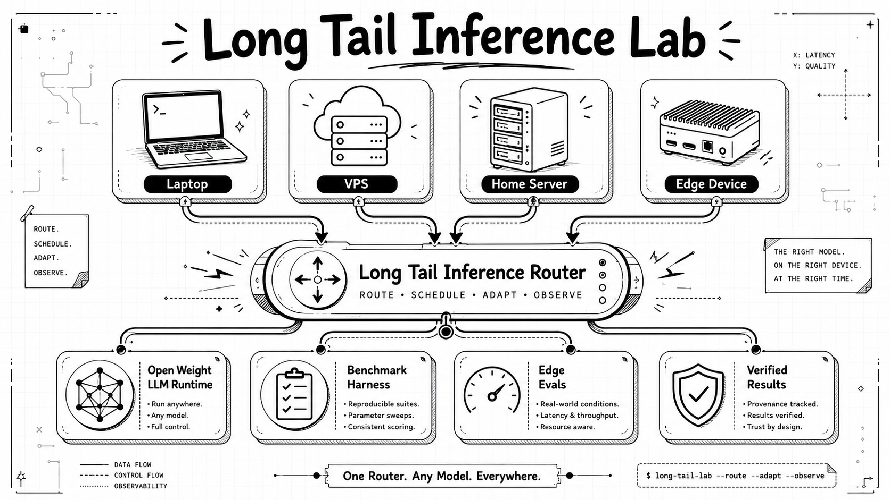

<p align="center">
  
</p>

# Long Tail Inference Lab

A research lab for testing whether verified cloud-teacher terminal work can become reusable local intelligence.

## Thesis

A lightweight local model does not need to know everything to become useful. It may need access to compact approved evidence produced by a stronger teacher on separate verified work.

Long Tail Inference Lab's preregistered protocol tests transfer from a fixed `gpt-5.6-sol` cloud teacher and sanitized-evidence distiller to one fixed local Qwen student. The student model stays fixed, approved teacher-derived Markdown memory grows, and held-out executable-verifier M0/M2 pairs decide whether capability improves.

## Active experiment

### [01 Terminal Artifact Memory](projects/01_terminal_artifact_memory/README.md)

**Status:** Preregistered (qualified teacher/student pilot awaiting measured execution; no measured result)

**Question:** Can verifier-passing public terminal work from a fixed `gpt-5.6-sol` cloud teacher become approved Markdown memory that improves a fixed local Qwen student on disjoint held-out tasks?

The cloud teacher solves only preregistered public memory-build tasks, so that interaction crosses the selected cloud boundary. Its resulting raw capture is retained in ignored local storage and is not retransmitted for distillation; strict local sanitizer, Gitleaks, canary, contamination, and residual gates run before an allowlisted sanitized-evidence packet may be sent to the same model. External human approval scoped to exact hashes is mandatory before admission. The exact local Qwen student is then evaluated under paired M0 (no memory) and M2 (approved Markdown retrieval), with the retrieved-memory block as the only student-context difference.

The executable verifier alone establishes build eligibility and held-out student outcomes. Teacher scores, model confidence, narrative success, tool-exit impressions, and distillation quality never substitute. Private verifier qualification raises confidence in each pinned task verifier without exposing hidden tests or verifier internals to either model.

The teacher boundary pins host Codex CLI 0.146.0, keeps subscription OAuth on the host, exposes only the isolated task tool, and captures ATIF provenance. The earlier genuine pilot remains intact: its first local Qwen M0 probe exceeded the frozen 16,384-token context before executable verification, so it produced no pair or memory checkpoint. See the [halted pilot report](projects/01_terminal_artifact_memory/results/2026-07-31-measured-pilot/summary.md). No teacher/student experiment has been measured yet.

## PARA organization

```text
projects/
  01_terminal_artifact_memory/

areas/
  lab_operations/
  public_website/

resources/
  assets/
  briefs/
  experiment_template/
  learning/
  project_proposals/
```

### Projects

Projects contain active experiments with a bounded research question, a measurement plan, and a completion condition. The lab intentionally has one active experiment until its first baseline and memory checkpoint results are published.

### Areas

Areas are ongoing responsibilities that keep the lab trustworthy, including reproducibility, safety, experiment discipline, result quality, repository maintenance, and public communication.

The [public website](areas/public_website/README.md) is an Area because it remains active as the laboratory evolves.

### Resources

Resources contain reusable learning material, references, proposals, templates, briefs, and media.

GitHub requires workflow configuration under `.github/`. That folder is repository plumbing rather than research content. Its purpose is documented in [`.github/CONFIGURATION.md`](.github/CONFIGURATION.md).

## Experiment lifecycle

```text
Idea → Specified → Running → Analyzing → Complete
```

An experiment is complete only when its baseline, results, interpretation, limitations, and operational conclusion are published.

## Learn through the lab

The active project is designed as a learning module:

1. Separate cloud teacher, cloud distiller, and local student roles.
2. Qualify task verifiers without exposing verifier internals to a model.
3. Build an explicit local-retention and cloud-disclosure boundary.
4. Admit only verifier-passing, sanitized, hash-approved Markdown.
5. Hold exact local Qwen controls fixed while memory grows.
6. Measure positive and negative transfer on disjoint held-out tasks.
7. Publish positive, negative, halted, and inconclusive results.

Start with the [field guide to learning LLM inference](resources/learning/field_guide.md).

## Safety posture

This repository avoids committing private hostnames, IP addresses, SSH details, API keys, tunnel configuration, private prompts, session content, and local machine paths.

Run the safety scan locally:

```bash
python3 areas/lab_operations/safety_scan.py
```

Or run it through pre commit:

```bash
pre-commit run --all-files
```
