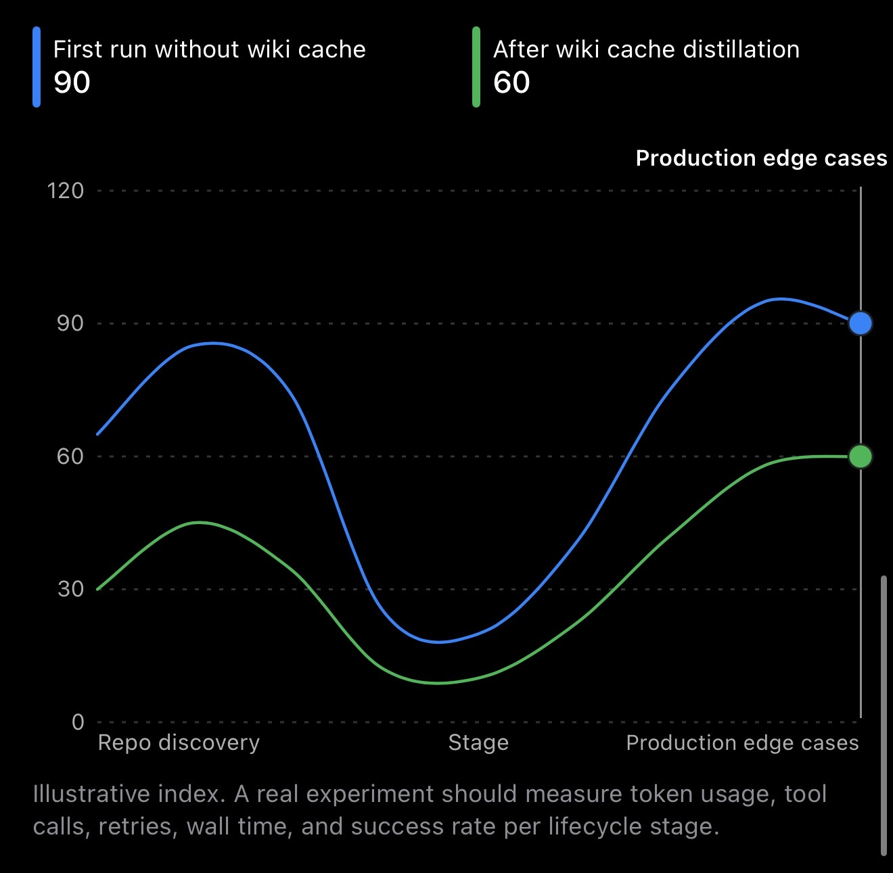

# 01 Memory Wiki

**Status:** Specified  
**Track:** Knowledge caching and inference routing  
**Difficulty:** Intermediate

## Research question

Can a human readable markdown knowledge cache help a local model answer more recurring questions while preserving answer quality and reducing frontier model usage?

## Why this belongs in the lab

Long tail inference is not only about distributing model execution across machines. It is also about avoiding unnecessary expensive inference when useful knowledge has already been produced.

This experiment treats a markdown wiki as a cache in front of local and frontier models. Questions that the wiki plus a local model can answer remain on the inexpensive path. Questions that fall outside the cache escalate to a frontier model. Accepted frontier answers are distilled into the wiki so similar future questions may become local cache hits.

## What you will learn

1. How cache concepts map to model routing.
2. How retrieval quality and local model confidence can guide escalation.
3. How to measure routing regret rather than only cost savings.
4. How durable knowledge can reduce repeated inference work.
5. Why human review matters when model output becomes shared memory.

## Hypothesis

Most questions inside a stable domain repeat or cluster. If high quality frontier answers are reviewed and written into a searchable wiki, the fraction of questions answered reliably by a local model should increase over time without a meaningful drop in answer quality.

The image is illustrative. The experiment must measure actual model usage, tool calls, retries, wall time, and task success.

## System model

### Gateway

A single gateway presents one interface to callers. Behind it sit:

1. A local open weight model.
2. A frontier model for escalation.
3. The routing logic that decides which path receives each question.

### Memory

The memory substrate is a collection of markdown files. Each entry contains a stable title, a summary, a body, source information, and links to related entries.

Markdown keeps the memory readable, reviewable, diffable, and portable.

### Retrieval

The initial retrieval path has two steps:

1. Embedding search returns the most relevant wiki entries.
2. One hop link traversal adds directly related context.

The one hop limit keeps latency and context size predictable. Whether it improves quality is itself a measurement.

### Routing

The first routing policy combines:

1. Retrieval similarity.
2. Local model confidence.
3. A small set of explicit safety and task rules.

A question stays local only when the evidence indicates that the necessary knowledge is already cached and the local answer is sufficiently reliable. Otherwise it escalates.

### Write back

An escalated answer becomes a candidate wiki entry. A distillation step converts it into durable reference material. The proposed entry enters through a pull request so a person can verify accuracy, remove conversational noise, and prevent duplicate or stale knowledge.

## Experiment sequence

### Phase 1: frontier baseline

Run a fixed question set through the frontier path without wiki assistance.

Record:

1. Task success.
2. Input and output tokens.
3. Tool calls.
4. Retries.
5. Wall time.
6. Estimated cost.

### Phase 2: seeded wiki

Create a small reviewed wiki from known project knowledge. Run the same question set through retrieval, local inference, and escalation.

Measure how often the local path succeeds and where it fails.

### Phase 3: distillation loop

Review escalated answers and write accepted knowledge back into the wiki. Repeat the question set with paraphrases and related questions.

Measure whether previously expensive question clusters migrate to the local path.

### Phase 4: robustness

Introduce stale entries, near duplicates, weak retrieval matches, and genuinely novel questions. Measure whether the router recognizes uncertainty instead of forcing local answers.

## Metrics

### Local answer rate

The fraction of questions answered without frontier escalation.

### Routing regret

False escalation wastes expensive inference. False local routing returns an answer below the required quality. Both directions must be measured.

### Quality

Use a fixed rubric and blind comparison where practical. Cost reduction is not useful if accepted answer quality falls materially.

### Escalation cost

Track frontier tokens, estimated spend, retries, and total wall time per accepted answer.

### Wiki health

Track entry count, duplication, staleness, orphan entries, retrieval usefulness, and the frequency with which retrieved entries contribute to accepted answers.

## Completion condition

This experiment is complete when:

1. A fixed evaluation set is published.
2. Frontier only and routed baselines are recorded.
3. At least one reviewed write back cycle is completed.
4. Routing regret and answer quality are evaluated.
5. Results, limitations, and a clear conclusion are published.

## Results

Results have not yet been collected.

[Results workspace](results/README.md)

## Open questions

1. What similarity and confidence thresholds produce acceptable routing regret?
2. Should the routing policy be learned or remain explicit?
3. When should an entry be updated instead of creating a new entry?
4. How should stale cached knowledge be detected?
5. Does one hop traversal improve accepted answer quality enough to justify its cost?
6. What is the smallest local model that keeps the local path useful?

## What this experiment does not claim

This experiment does not claim that a wiki replaces frontier reasoning. It asks whether reviewed knowledge can absorb recurring work so frontier inference is reserved for genuinely novel or difficult questions.
