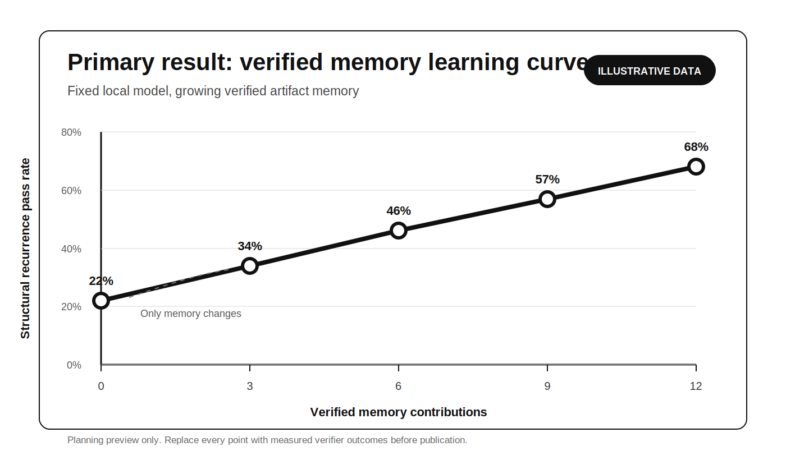
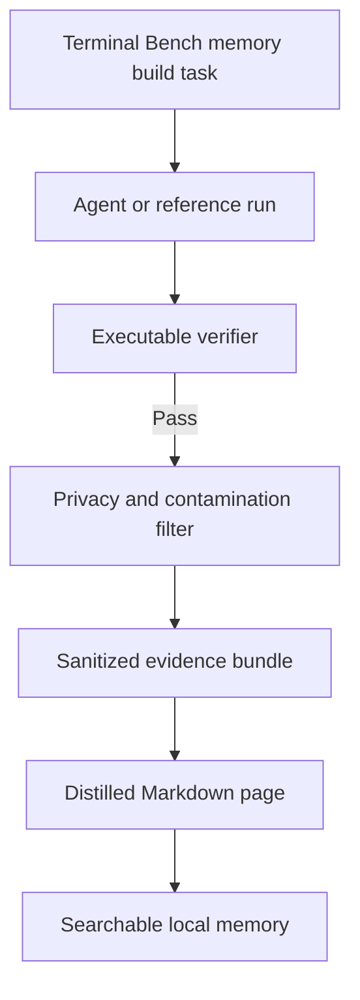
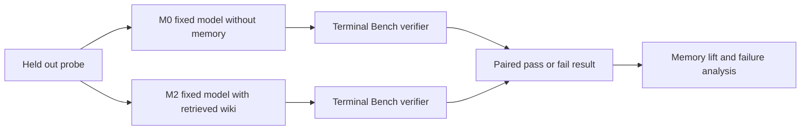

# 01 Terminal Artifact Memory

**Status:** Specified  
**Track:** Artifact memory and local inference  
**Difficulty:** Intermediate  
**Last updated:** July 14 2026

## Primary result we want to produce



The chart above is the main result this experiment is designed to produce. The values are illustrative planning data, not measured results.

The model remains fixed. Only the number of verified memory contributions grows. The experiment asks whether the structural recurrence pass rate rises with that growing memory.

## One minute summary

**Question:** Can verified artifacts from completed terminal benchmark tasks make a fixed lightweight local model increasingly useful on recurring engineering problems?

**Exact test:** Run the same preregistered evaluation probes with the same local model under paired memory conditions. Compare the Terminal Bench verifier pass rate with no memory against the pass rate with retrieved distilled memory.

**Core control:** The model stays fixed. The memory grows.

**Primary comparison:** M0 no memory versus M2 distilled Markdown wiki.

**Primary outcome:** Structural recurrence memory lift at each memory checkpoint.

**Ground truth:** The Terminal Bench executable verifier. A learned judge never overrides it.

**Success boundary:** Structural recurrence improves materially over the no memory baseline, negative transfer remains acceptably low, unsafe confident errors remain rare, and the benefit survives held out task family evaluation.

**Stop boundary:** Stop or simplify if memory only helps exact repeats, if stale or irrelevant memory creates meaningful regressions, if simple file search performs nearly as well, or if the benefit disappears on held out task families.

## Exact condition being tested

For every held out structurally recurring Terminal Bench probe, run the same fixed local model under two primary conditions:

1. **M0:** The task is provided without artifact memory.
2. **M2:** The task is provided with retrieved pages from the distilled Markdown wiki.

After each attempt, run the benchmark verifier.

```text
structural memory lift at checkpoint N
=
M2 structural verifier pass rate at checkpoint N
minus
M0 structural verifier pass rate
```

The experiment succeeds only if memory improves unseen structurally related tasks rather than merely helping exact repeats.

## What happens after Terminal Bench runs

### Memory construction runs

A selected set of Terminal Bench tasks is completed by an agent or reference process. Every successful run passes the executable verifier before its artifacts may enter memory.



One verified memory contribution contains:

1. Task family and environment metadata.
2. A sanitized command and outcome timeline.
3. Failure signatures.
4. Relevant environment facts.
5. The final verified patch, configuration change, or command sequence.
6. Verifier outcome.
7. Artifact hashes and provenance.
8. A distilled Markdown page.
9. Known limitations and transfer boundaries.

Failed attempts may be retained only when they are clearly labeled and linked to the final verifier outcome. They must never be represented as successful solutions.

### Evaluation runs

The evaluation set contains separate probes that cannot contribute artifacts to the memory used for their own evaluation.



The same probe set, model, prompt, decoding settings, runtime, hardware, context limit, and tool permissions are used across paired conditions.

## Why this experiment is useful

Traditional evaluation asks how capable a model is. This experiment asks how efficiently verified experience can extend the usable capability of a fixed model.

A positive result would support a system where recurring engineering work stays local while unfamiliar or insufficiently supported work is escalated to stronger inference.

A negative result would support avoiding a complex memory layer and using direct stronger inference or simpler search.

A mixed result should identify whether the limiting factor is artifact quality, retrieval, local model capacity, environment matching, or evaluation design.

## Questions the final results must answer

### 1. Does verified memory improve structural recurrence?

This is the central scientific question.

```text
structural recurrence pass rate
=
structural probes passing the verifier
/
all structural probes attempted
```

The final report must show the paired no memory and wiki memory pass rates at every checkpoint.

### 2. What is the verified knowledge yield?

This asks how much tested operational value is produced by the local dataset.

```text
verified knowledge yield
=
additional structural probes passed because of memory
/
verified memory contributions
```

A storage normalized version is also reported:

```text
knowledge efficiency
=
additional accepted structural answers
/
searchable memory bytes
```

This helps determine whether the system is accumulating reusable intelligence or merely accumulating documentation.

### 3. When does memory hurt?

Average improvement can hide regressions. Every paired probe must be classified as one of four outcomes.

<table>
<thead>
<tr><th>M0 result</th><th>M2 result</th><th>Interpretation</th></tr>
</thead>
<tbody>
<tr><td>Fail</td><td>Pass</td><td>Positive transfer</td></tr>
<tr><td>Pass</td><td>Fail</td><td>Negative transfer</td></tr>
<tr><td>Pass</td><td>Pass</td><td>Stable success</td></tr>
<tr><td>Fail</td><td>Fail</td><td>Unresolved task</td></tr>
</tbody>
</table>

```text
negative transfer rate
=
probes that pass under M0 and fail under M2
/
all paired probes
```

The final report must show the raw positive and negative transfer counts. A net score may be reported, but it must never hide individual harmful regressions.

```text
net memory benefit
=
positive transfers
minus
negative transfers
```

Every negative transfer should be traced to a likely cause such as stale instructions, irrelevant retrieval, contradictory memory, environment mismatch, or increased unsupported confidence.

### 4. Which engineering patterns become reliably local?

Overall memory lift is not enough to make a routing decision. Results must be separated by preregistered task family.

Example families include dependency conflicts, build failures, environment setup, configuration errors, permissions, and networking failures.

For each family, report:

1. M0 structural pass rate.
2. M2 structural pass rate.
3. Memory lift.
4. Positive transfer count.
5. Negative transfer count.
6. Retrieval coverage.
7. Unsafe confident error rate.
8. Median latency.

The operational question is:

> Which kinds of engineering work become reliably local after the system has seen and verified the underlying pattern before?

This family level view determines where local inference should be attempted, where more evidence should be collected, and where escalation remains the safer default.

### 5. Was the needed knowledge retrieved?

For each structural probe, the evaluation plan identifies which memory pages are relevant before the run is scored.

```text
retrieval recall at K
=
probes where a relevant page appears in the top K results
/
probes where relevant knowledge exists
```

This separates retrieval failure from model usage or execution failure.

1. Relevant page absent means retrieval failed.
2. Relevant page present but verifier fails means the model or execution path failed to use the evidence.

### 6. Does memory remain safe on novel controls?

Novel controls intentionally lack sufficient knowledge in memory or contain weak misleading matches.

Report:

1. Appropriate abstention rate.
2. Unsupported confident answer rate.
3. Unsafe confident error rate.
4. Verifier pass rate where execution is valid.

The goal is not for memory to solve every novel problem. The goal is for irrelevant memory not to mislead the model.

## Main result visualizations

The final report should prioritize five visualizations.

1. **Primary learning curve:** Structural recurrence pass rate as verified memory grows.
2. **Paired transfer matrix:** Positive transfer, negative transfer, stable success, and unresolved tasks.
3. **Task family lift:** Memory lift and regressions by engineering pattern.
4. **Verified knowledge yield:** Additional structural successes per contribution and per searchable megabyte.
5. **Retrieval diagnosis:** Relevant evidence retrieved versus model use and execution outcome.

The first visualization is the signature figure for this experiment. The remaining figures explain why the curve moved and whether the improvement is operationally trustworthy.

## Probe categories

### Exact recurrence

The same underlying problem returns with changed values, paths, versions, or service names.

### Structural recurrence

A different task contains the same failure mechanism or repair pattern. This is the primary scientific target because it measures reusable engineering knowledge rather than exact task recall.

### Novel control

The required knowledge is absent from memory, or retrieved evidence is weak and misleading. This measures whether the system recognizes insufficiency and abstains safely.

## Workload and split

The first workload uses a preregistered subset of Terminal Bench 2.0 tasks.

The initial target is twelve memory build tasks across at least three recurring engineering families. The exact task list and family assignment must be published before the first memory assisted evaluation.

The split has three roles:

1. **Memory build tasks:** Verified tasks whose artifacts may enter memory.
2. **Recurrence probes:** Separate exact and structural tasks used to measure transfer.
3. **Held out families:** Task families excluded from judge training, threshold tuning, and retriever tuning.

Reference solutions, hidden tests, and verifier implementation details must never enter model context or searchable memory.

## Memory conditions

<table>
<thead>
<tr><th>ID</th><th>Memory condition</th><th>Purpose</th></tr>
</thead>
<tbody>
<tr><td>M0</td><td>No memory</td><td>Fixed local model baseline</td></tr>
<tr><td>M1</td><td>Sanitized evidence</td><td>Test whether raw verified artifacts are directly useful</td></tr>
<tr><td>M2</td><td>Distilled Markdown wiki</td><td>Primary test of compact readable knowledge</td></tr>
<tr><td>M3</td><td>Evidence plus wiki</td><td>Test whether summaries and source evidence complement each other</td></tr>
</tbody>
</table>

The primary claim is established with the paired M0 versus M2 comparison. M1 and M3 are representation studies.

Later extensions may test structured facts, embeddings, hybrid retrieval, learned ranking, graph links, and compressed memory. They begin only after the simple paired baseline is measured.

## Wiki structure

```text
wiki/
  index.md
  task_patterns/
  failure_modes/
  commands/
  solutions/
  evidence/
    task_001/
      manifest.json
      command_outcomes.jsonl
      verifier_result.json
      sanitized_log.txt
  manifests/
    artifact_index.jsonl
```

Each distilled page records:

1. Stable title.
2. Problem pattern.
3. Observable symptoms.
4. Environment assumptions.
5. Diagnostic sequence.
6. Verified resolution.
7. Supporting evidence identifiers.
8. Failure cases and limitations.
9. Provenance.
10. Freshness and supersession status.
11. Related pages.

Markdown keeps memory readable, reviewable, portable, and easy to compare across revisions. Evidence links prevent summaries from becoming unsupported claims.

## Fixed controls

Keep these fixed during the core learning curve:

1. Local model weights.
2. Quantization.
3. Prompt template.
4. Decoding parameters.
5. Inference runtime and version.
6. Hardware.
7. Context limit.
8. Benchmark split.
9. Tool permissions.
10. Maximum retrieved context.

Qwen and GLM are candidate model families. The first run uses one pinned lightweight model. Model comparisons begin only after the memory effect has been measured with a fixed model.

## Retrieval plan

Start with BM25 or an equivalent lexical method. It is fast, interpretable, and establishes whether semantic infrastructure is necessary.

Add embeddings only after the lexical baseline is recorded.

A later ranker may use lexical score, embedding score, task family similarity, environment similarity, failure signature overlap, evidence recency, prior verifier success, and contradiction indicators.

Prefer logistic regression, a linear ranker, or a small gradient boosted tree before a neural reranker because the initial dataset is small and interpretability matters.

## Evaluation hierarchy

### Authoritative signals

1. Benchmark verifier pass or fail.
2. Required files or state produced.
3. Expected facts present.
4. Prohibited actions absent.
5. Claims supported by retrieved evidence.
6. Appropriate abstention when evidence is insufficient.

A learned judge never overrides a failed verifier.

### Learned local sufficiency judge

The learned judge is a later routing extension. It is not the source of the primary experiment score.

It estimates:

```text
P local answer succeeds without stronger inference
```

The initial model should be an interpretable logistic regression trained from completed runs whose target is the authoritative verifier result.

Candidate features include retrieval coverage, independent support count, evidence agreement, environment similarity, contradiction count, answer completeness, calibrated confidence, abstention signal, latency, and context size.

Training, threshold selection, and evaluation must be split by task family. A random question split is not sufficient because related tasks can leak across the boundary.

## Metrics

### Verifier pass rate

```text
passed executable probes
/
executable probes attempted
```

### Structural recurrence pass rate

Verifier pass rate on tasks that share a failure mechanism but are not exact repeats.

### Memory lift at checkpoint N

```text
pass rate with N verified memory contributions
minus
no memory pass rate
```

### Generalization ratio

```text
structural recurrence lift
/
exact recurrence lift
```

A ratio near zero suggests memorization without meaningful transfer.

### Verified knowledge yield

```text
additional structural passes
/
verified memory contributions
```

### Negative transfer rate

```text
M0 passes that become M2 failures
/
all paired probes
```

### Unsafe confident error rate

The fraction of probes where high confidence accompanies an incorrect, unsupported, destructive, or policy violating response.

### Routing regret

Measure false local routing and unnecessary escalation separately because their costs are not symmetric.

### Break even point

The earliest memory checkpoint where every preregistered condition holds.

Initial candidate conditions:

1. Structural recurrence pass rate of at least 70 percent.
2. Memory lift of at least 15 percentage points.
3. Negative transfer rate below the preregistered limit.
4. Unsafe confident error rate no greater than 5 percent.
5. The lower confidence bound remains above the no memory baseline.
6. Latency and peak memory remain within the local device budget.

These thresholds are provisional and must be finalized before the first run.

Also record median and p95 latency, prompt and output tokens, peak memory, retrieval time, index size, wiki size, artifact processing time, duplicate pages, stale pages, unsupported claims, contradictions, and retrieval contribution.

## Experiment sequence

### Phase 0: Lock the protocol

1. Select the benchmark subset and task families.
2. Publish memory build, recurrence, and held out splits.
3. Freeze the local model, runtime, prompts, and decoding.
4. Finalize success, regression, safety, and stop thresholds.
5. Confirm benchmark license and artifact handling rules.

### Phase 1: Record the no memory baseline

Run every probe with the fixed local model under M0.

### Phase 2: Build verified memory

Complete the first memory build tasks and emit sanitized evidence bundles. Begin with three tasks before scaling.

### Phase 3: Produce memory representations

Produce M1, M2, and M3 from the same verified runs so representation is the primary difference.

### Phase 4: Measure the learning curve

Evaluate the same preregistered probes at:

```text
0 → 3 → 6 → 9 → 12 verified tasks
```

Run paired M0 and M2 evaluation, followed by M1 and M3 representation comparisons.

### Phase 5: Explain the curve

Measure retrieval coverage, verified knowledge yield, negative transfer, task family lift, latency, and storage efficiency.

### Phase 6: Compare retrieval methods

Compare lexical, semantic, and hybrid retrieval only after the core curve is visible.

### Phase 7: Train the local sufficiency judge

Train on earlier task families and evaluate on held out families. Report calibration, ROC AUC, precision at the local threshold, false local rate, and uncertainty.

### Phase 8: Run stress and removal tests

Introduce stale pages, near duplicates, contradictions, irrelevant high similarity artifacts, missing evidence, noisy logs, novel controls, environment changes, and corrupted metadata.

Then remove one component at a time. Keep a component only when its contribution changes the operational decision.

## Safety and contamination boundary

Committed artifacts must not contain:

1. Credentials or tokens.
2. Private hostnames or IP addresses.
3. Private repository names.
4. Local file system paths.
5. Unrelated conversation text.
6. Machine identifiers.
7. Hidden tests.
8. Reference solutions not intended for model access.
9. Verifier details that reveal the answer.
10. Benchmark data prohibited by its license.

The sanitizer must produce a report for every evidence bundle. Canary values should test whether sensitive spans can pass silently.

Unacceptable outcomes include:

1. Secret or private path exposure.
2. Hidden test or reference answer leakage.
3. Execution outside the isolated benchmark.
4. High confidence destructive instructions.
5. A judge approving an answer that contradicts the verifier.
6. Stale memory silently overriding newer verified evidence.
7. Evaluation leakage between task families.
8. Synthetic data presented as measured evidence.

Any breach stops the affected run and triggers artifact removal, root cause analysis, and renewed safety validation.

## Data schema

The main run record is `runs.csv`.

<table>
<thead>
<tr><th>Column</th><th>Meaning</th></tr>
</thead>
<tbody>
<tr><td>run_id</td><td>Stable run identifier</td></tr>
<tr><td>task_id</td><td>Public benchmark task identifier</td></tr>
<tr><td>task_family</td><td>Preregistered recurring pattern</td></tr>
<tr><td>memory_checkpoint</td><td>Verified contributions available</td></tr>
<tr><td>memory_condition</td><td>M0 M1 M2 or M3</td></tr>
<tr><td>retriever</td><td>Retrieval configuration</td></tr>
<tr><td>model_id</td><td>Exact local model identifier</td></tr>
<tr><td>quantization</td><td>Model quantization</td></tr>
<tr><td>runtime</td><td>Runtime and version</td></tr>
<tr><td>question_type</td><td>Exact structural or novel</td></tr>
<tr><td>verifier_passed</td><td>Authoritative executable outcome</td></tr>
<tr><td>deterministic_score</td><td>Expected fact score when applicable</td></tr>
<tr><td>abstained</td><td>Whether the model declined</td></tr>
<tr><td>unsafe_error</td><td>Whether a ruin relevant response occurred</td></tr>
<tr><td>judge_probability</td><td>Predicted local sufficiency</td></tr>
<tr><td>latency_seconds</td><td>End to end latency</td></tr>
<tr><td>peak_memory_mb</td><td>Peak memory</td></tr>
<tr><td>prompt_tokens</td><td>Input token count</td></tr>
<tr><td>output_tokens</td><td>Output token count</td></tr>
<tr><td>wiki_bytes</td><td>Searchable wiki size</td></tr>
<tr><td>artifact_bytes</td><td>Searchable evidence size</td></tr>
<tr><td>seed</td><td>Random seed</td></tr>
</tbody>
</table>

Also publish `retrieval.jsonl` and `artifact_manifest.jsonl` with safe identifiers, scores, ranks, hashes, sanitizer version, provenance, verifier outcome, and supersession state.

## Completion condition

The experiment is complete when:

1. The benchmark subset and family split are published.
2. A frozen local model baseline is recorded.
3. The collector produces privacy safe verified evidence bundles.
4. M0 through M3 are evaluated.
5. At least three memory checkpoints are measured.
6. Exact, structural, and novel results are separated.
7. Verified knowledge yield is reported.
8. Positive and negative transfer are reported separately.
9. Results are separated by task family.
10. The judge is evaluated on held out task families.
11. Stress and removal tests are complete.
12. Tail behavior and ruin boundaries are analyzed.
13. Results, limitations, and an operational conclusion are published.
14. The conclusion states what should be built next and what should not.

## Results

Results have not yet been collected. The chart at the top uses illustrative data only.

[Open the results workspace](results/README.md)

## What this experiment does not claim

This experiment does not claim that a wiki changes model weights, that exact recall is general reasoning, that one benchmark represents all terminal work, that a learned judge establishes correctness, that local inference should replace stronger models, or that generated commands are safe outside an isolated benchmark.

It asks a narrower question: whether verified work can become useful local evidence, how efficiently that evidence extends capability, where it helps, and where it causes regressions.

## Next smallest implementation

1. Select three memory build tasks from one recurring family.
2. Select separate structural recurrence probes from the same family.
3. Freeze the model, runtime, prompt, retriever, and evaluation rules.
4. Record M0 results for every probe.
5. Run and verify the memory build tasks.
6. Produce sanitized evidence bundles and one distilled page per task.
7. Record M2 results for the same probes.
8. Report positive transfer, negative transfer, retrieval coverage, and verified knowledge yield.
9. Inspect every retrieval and answer manually.
10. Continue only if the pilot reveals measurable signal and no ruin boundary breach.
