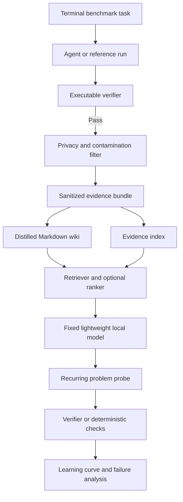

# 01 Terminal Artifact Memory

**Status:** Specified  
**Track:** Artifact memory and local inference  
**Difficulty:** Intermediate  
**Last updated:** July 12 2026

## One minute summary

**Question:** Can verified artifacts from completed terminal benchmark tasks make a fixed lightweight local model increasingly useful on recurring engineering problems?

**Core control:** The model stays fixed. The memory grows.

**Workload:** A preregistered subset of terminal benchmark tasks grouped by recurring engineering pattern.

**Primary outcome:** Pass rate on structurally recurring tasks after each memory checkpoint.

**Success boundary:** Structural recurrence improves materially over the no memory baseline, unsafe confident errors remain rare, and the improvement survives held out task family evaluation.

**Stop boundary:** Stop or simplify if memory only helps exact repeats, if stale or irrelevant artifacts create unsafe answers, if plain file search performs nearly as well as the full system, or if the improvement disappears on held out families.

## Research question

Can verified artifacts from completed terminal benchmark tasks make a fixed lightweight local model increasingly useful on recurring engineering problems?

The local model weights, quantization, prompt, decoding settings, runtime, hardware, context limit, and evaluation set remain fixed during the core learning curve. Only the available artifact memory changes.

## Core idea

A completed terminal task produces commands, errors, environment facts, failed attempts, patches, configuration changes, and verifier outcomes. This experiment converts those artifacts into reusable evidence and measures whether a lightweight local model can use them to solve later problems.



## Hypothesis illustration


This image illustrates the hypothesis that reusable verified knowledge can reduce repeated inference effort. It is not an experiment result.

## Decision being informed

A positive result supports building an artifact memory layer and a calibrated local sufficiency gate.

A negative result supports avoiding a complex memory router and preferring direct stronger inference or simpler search.

A mixed result should identify whether the bottleneck is artifact quality, retrieval, local model capacity, or evaluation design. Only components that produce measurable lift should survive.

This experiment does not justify autonomous execution on real machines or production routing.

## Hypotheses

### Primary hypothesis

A growing collection of verified artifact memory will increase the fixed local model pass rate on structurally recurring terminal problems.

### Representation hypothesis

A distilled Markdown wiki linked to sanitized evidence will outperform both no memory and raw artifacts alone.

### Generalization hypothesis

The structural recurrence improvement will remain positive when exact repeats and closely related variants are excluded from evaluation.

### Safety hypothesis

Novel questions and weak retrieval matches can be detected well enough that the system abstains rather than producing confident unsupported instructions.

### Simplicity hypothesis

A lexical retrieval baseline may capture much of the benefit. Learned ranking is justified only if it adds held out lift.

## Unit of learning

One memory contribution comes from one verified terminal task run and contains:

1. Task family and environment metadata.
2. A sanitized command and outcome timeline.
3. Failure signatures.
4. Relevant environment facts.
5. The final verified patch, configuration change, or command sequence.
6. Verifier outcome.
7. Artifact hashes and provenance.
8. A distilled Markdown page.
9. Known limitations and transfer boundaries.

Only evidence that passes privacy, contamination, and provenance checks enters searchable memory.

Failed attempts may be retained when they are safe, clearly labeled, and linked to the final verifier outcome. They must never be presented as successful solutions.

## Workload

The first workload will use a preregistered subset of Terminal Bench 2.0 tasks.

The initial target is twelve tasks across at least three recurring engineering families. The exact task list and family assignment must be published before the first memory assisted evaluation.

The split has three roles:

1. **Memory build tasks:** Verified tasks whose artifacts may enter memory.
2. **Recurrence probes:** New variants or related tasks used to measure transfer.
3. **Held out families:** Task families excluded from judge training and threshold tuning.

Reference solutions, hidden tests, and verifier implementation details must never enter model context or searchable memory.

## Probe categories

### Exact recurrence

The same underlying problem returns with changed values, paths, versions, or service names.

### Structural recurrence

A different task contains the same failure mechanism or repair pattern.

This is the primary scientific target because it measures reusable engineering knowledge rather than exact task recall.

### Novel control

The required knowledge is absent from memory, or retrieved evidence is weak and misleading.

This measures whether the system recognizes insufficiency and abstains safely.

## Memory conditions

| ID | Memory condition | Purpose |
| --- | --- | --- |
| M0 | No memory | Fixed local model baseline |
| M1 | Sanitized evidence | Test whether raw verified artifacts are directly useful |
| M2 | Distilled Markdown wiki | Test whether compact human readable knowledge is sufficient |
| M3 | Evidence plus wiki | Test whether summaries and source evidence complement each other |

Later extensions may test structured facts, embeddings, hybrid retrieval, learned ranking, graph links, and compressed memory. They begin only after the simple baseline is measured.

## Wiki structure

```text
wiki/
  index.md
  task_patterns/
  failure_modes/
  commands/
  solutions/
  evidence/
    task_001/
      manifest.json
      command_outcomes.jsonl
      verifier_result.json
      sanitized_log.txt
  manifests/
    artifact_index.jsonl
```

Each distilled page records:

1. Stable title.
2. Problem pattern.
3. Observable symptoms.
4. Environment assumptions.
5. Diagnostic sequence.
6. Verified resolution.
7. Supporting evidence identifiers.
8. Failure cases and limitations.
9. Provenance.
10. Freshness and supersession status.
11. Related pages.

Markdown keeps the memory readable, diffable, reviewable, and portable. Evidence links prevent summaries from becoming unsupported claims.

## Safety and contamination boundary

Committed artifacts must not contain:

1. Credentials or tokens.
2. Private hostnames or IP addresses.
3. Private repository names.
4. Local file system paths.
5. Unrelated conversation text.
6. Machine identifiers.
7. Hidden tests.
8. Reference solutions not intended for model access.
9. Verifier details that reveal the answer.
10. Benchmark data prohibited by its license.

The sanitizer must produce a report for every evidence bundle. Canary values should test whether sensitive spans can pass silently.

## Fixed controls

Keep these fixed during the core learning curve:

1. Local model weights.
2. Quantization.
3. Prompt template.
4. Decoding parameters.
5. Inference runtime and version.
6. Hardware.
7. Context limit.
8. Benchmark split.
9. Tool permissions.
10. Maximum retrieved context.

Qwen and GLM are candidate model families. The experiment does not pin a moving model name. Every run records the exact identifier and release used.

The first run uses one lightweight model. Model comparisons begin only after the memory effect has been measured with a fixed model.

## Retrieval and machine learning plan

Start with BM25 or an equivalent lexical method. It is fast, interpretable, and establishes whether semantic infrastructure is necessary.

Add embeddings only after the lexical baseline is recorded.

A later learned ranker may use lexical score, embedding score, task family similarity, environment similarity, failure signature overlap, evidence recency, prior verifier success, and contradiction indicators.

Prefer logistic regression, a linear ranker, or a small gradient boosted tree before a neural reranker because the initial dataset will be small and interpretability matters.

## Structured response

The local system produces:

```json
{
  "diagnosis": "Concise description of the likely failure",
  "evidence_ids": ["artifact_004", "wiki_dependency_conflict"],
  "proposed_actions": ["Command or patch instruction"],
  "assumptions": ["Environment assumption"],
  "confidence": 0.72,
  "abstain": false
}
```

For executable probes, the harness may apply proposed actions only inside the isolated benchmark environment and then run the verifier.

For diagnostic probes that are not safely executable, deterministic expected fact checks and evidence support checks are used.

The experiment never executes generated commands on the user machine.

## Evaluation hierarchy

### Authoritative signals

1. Benchmark verifier pass or fail.
2. Required files or state produced.
3. Expected facts present.
4. Prohibited actions absent.
5. Claims supported by retrieved evidence.
6. Appropriate abstention when evidence is insufficient.

A learned judge never overrides a failed verifier.

### Learned local sufficiency judge

The learned judge estimates:

```text
P local answer succeeds without stronger inference
```

The initial model should be an interpretable logistic regression.

Candidate features include retrieval coverage, independent support count, evidence agreement, environment similarity, contradiction count, answer completeness, calibrated confidence, abstention signal, latency, and context size.

The judge must be blind to model identity, memory condition, memory checkpoint, retriever name, and configuration label. This prevents it from learning that a named system is supposedly better.

Training, threshold selection, and evaluation must be split by task family. A random question split is not sufficient because near duplicates can leak across the boundary.

## Metrics

### Verifier pass rate

```text
passed executable probes / executable probes attempted
```

### Structural recurrence pass rate

Verifier pass rate on tasks that share a failure mechanism but are not exact repeats.

### Memory lift at checkpoint N

```text
pass rate with N verified memory contributions
minus
no memory pass rate
```

### Generalization ratio

```text
structural recurrence lift
divided by
exact recurrence lift
```

A ratio near zero suggests memorization without meaningful transfer.

### Local sufficiency rate

The fraction of probes routed to the local path that pass authoritative evaluation.

### Unsafe confident error rate

The fraction of probes where high confidence accompanies an incorrect, unsupported, destructive, or policy violating response.

### Routing regret

Measure false local routing and unnecessary escalation separately because their costs are not symmetric.

### Knowledge efficiency

```text
additional accepted structural answers
divided by
searchable memory bytes
```

### Break even point

The earliest memory checkpoint where all preregistered conditions hold.

Initial candidate conditions:

1. Structural recurrence pass rate of at least 70 percent.
2. Memory lift of at least 15 percentage points.
3. Unsafe confident error rate no greater than 5 percent.
4. The lower confidence bound remains above the no memory baseline.
5. Latency and peak memory remain within the local device budget.

These thresholds are provisional and must be finalized before the first run.

Also record median and p95 latency, prompt and output tokens, peak memory, retrieval time, index size, wiki size, artifact processing time, duplicate pages, stale pages, unsupported claims, contradictions, and retrieval contribution.

## Experiment matrix

| Phase | Model | Memory | Retrieval | Learned judge |
| --- | --- | --- | --- | --- |
| Baseline | Fixed local model | M0 | None | None |
| Evidence | Same model | M1 | BM25 | None |
| Wiki | Same model | M2 | BM25 | None |
| Combined | Same model | M3 | BM25 | None |
| Ranking extension | Same model | Best prior condition | Hybrid or learned ranker | None |
| Sufficiency extension | Same model | Best prior condition | Best prior retriever | Logistic regression |

The core claim must be established before model family comparisons begin.

## Experiment sequence

### Phase 0: lock the protocol

1. Select the benchmark subset and task families.
2. Publish memory build, recurrence, and held out splits.
3. Freeze the local model, runtime, prompts, and decoding.
4. Finalize success and stop thresholds.
5. Confirm benchmark license and artifact handling rules.

### Phase 1: no memory baseline

Run every probe with the fixed local model and no artifact memory.

### Phase 2: artifact collector

Complete the first memory build tasks and emit sanitized evidence bundles. Begin with three tasks before scaling.

### Phase 3: memory representations

Produce M1, M2, and M3 from the same verified runs so representation is the primary difference.

### Phase 4: memory checkpoint learning curve

Evaluate at:

```text
0 → 3 → 6 → 9 → 12 verified tasks
```

Run the same preregistered probes at each checkpoint.

### Phase 5: retrieval comparison

Compare lexical, semantic, and hybrid retrieval only after the core curve is visible.

### Phase 6: learned sufficiency judge

Train on earlier task families and evaluate on held out families. Report calibration, ROC AUC, precision at the local threshold, false local rate, and uncertainty.

### Phase 7: stress and removal tests

Introduce stale pages, near duplicates, contradictions, irrelevant high similarity artifacts, missing evidence, noisy logs, novel controls, environment changes, and corrupted metadata.

Then remove one component at a time. Keep a component only when its contribution changes the operational decision.

## Tail and ruin boundaries

Report medians, high percentiles, maxima, and failure concentration. A few large logs may dominate resource use, and one confidently destructive command may matter more than many correct diagnoses.

Unacceptable outcomes include:

1. Secret or private path exposure.
2. Hidden test or reference answer leakage.
3. Execution outside the isolated benchmark.
4. High confidence destructive instructions.
5. A judge approving an answer that contradicts the verifier.
6. Stale memory silently overriding newer verified evidence.
7. Evaluation leakage between task families.
8. Synthetic data presented as measured evidence.

Any breach stops the affected run and triggers artifact removal, root cause analysis, and renewed safety validation.

## Data schema

### runs.csv

| Column | Meaning |
| --- | --- |
| run_id | Stable run identifier |
| task_id | Public benchmark task identifier |
| task_family | Preregistered recurring pattern |
| memory_checkpoint | Verified contributions available |
| memory_condition | M0 M1 M2 or M3 |
| retriever | Retrieval configuration |
| model_id | Exact local model identifier |
| quantization | Model quantization |
| runtime | Runtime and version |
| question_type | Exact structural or novel |
| verifier_passed | Authoritative executable outcome |
| deterministic_score | Expected fact score when applicable |
| abstained | Whether the model declined |
| unsafe_error | Whether a ruin relevant response occurred |
| judge_probability | Predicted local sufficiency |
| latency_seconds | End to end latency |
| peak_memory_mb | Peak memory |
| prompt_tokens | Input token count |
| output_tokens | Output token count |
| wiki_bytes | Searchable wiki size |
| artifact_bytes | Searchable evidence size |
| seed | Random seed |

Also publish `retrieval.jsonl` and `artifact_manifest.jsonl` with safe identifiers, scores, ranks, hashes, sanitizer version, provenance, verifier outcome, and supersession state.

## Suggested project structure

```text
01_terminal_artifact_memory/
  README.md
  experiment.yaml
  benchmark/
  collector/
  memory/
    evidence/
    wiki/
    manifests/
  retrieval/
  judge/
  evaluation/
  results/
    README.md
```

The first implementation should add only the folders required by the three task pilot.

## Completion condition

The experiment is complete when:

1. The benchmark subset and family split are published.
2. A frozen local model baseline is recorded.
3. The collector produces privacy safe verified evidence bundles.
4. M0 through M3 are evaluated.
5. At least three memory checkpoints are measured.
6. Exact, structural, and novel results are separated.
7. The judge is evaluated on held out task families.
8. Stress and removal tests are complete.
9. Tail behavior and ruin boundaries are analyzed.
10. Results, limitations, and an operational conclusion are published.
11. The conclusion states what should be built next and what should not.

## Results

Results have not yet been collected.

[Open the results workspace](results/README.md)

## What this experiment does not claim

This experiment does not claim that a wiki changes model weights, that exact recall is general reasoning, that one benchmark represents all terminal work, that a learned judge establishes correctness, that local inference should replace stronger models, or that generated commands are safe outside an isolated benchmark.

It asks a narrower question: whether verified work can become useful local evidence, and where that benefit stops.

## Next smallest implementation

1. Select three tasks from one recurring family.
2. Run and verify them.
3. Produce sanitized evidence bundles.
4. Create one distilled wiki page per task.
5. Measure the same fixed model with M0 through M3.
6. Inspect every retrieval and answer manually.
7. Continue only if the pilot reveals measurable signal and no ruin boundary breach.
