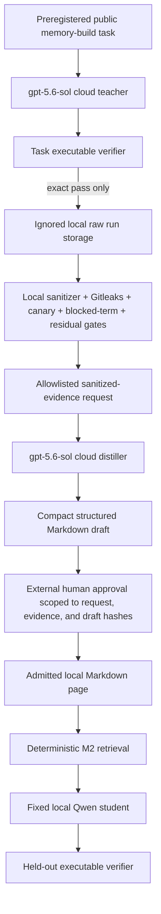

# 01 Terminal Artifact Memory

**Status:** Preregistered — qualified GPT-5.6-sol/Qwen 32K pilot awaiting measured execution
**Track:** `artifact_memory` and local inference
**Difficulty:** Intermediate  
**Last updated:** August 1 2026

## One minute summary

**Question:** Can verified solutions produced by a fixed cloud teacher become compact approved memory that improves a fixed local student on disjoint held-out terminal tasks?

**Teacher and distiller:** exact model identity `gpt-5.6-sol`. The teacher solves only preregistered public memory-build tasks. The distiller drafts compact structured Markdown only from evidence that passed an executable verifier and every local sanitization gate.

**Student and sole evaluation model:** official Apache-2.0 `Qwen/Qwen2.5-Coder-7B-Instruct-GGUF`, Hugging Face revision `13fb94bfda8c8cf22497dc57b78f391a9acb426a`, Q4_K_M, SHA-256 `509287f78cb4d4cf6b3843734733b914b2c158e43e22a7f4bf5e963800894d3c`, served through pinned llama.cpp.

**Primary comparison:** the same held-out Qwen probe under paired M0 (no memory) and M2 (retrieved approved teacher-derived Markdown). The rendered retrieved-memory block is the only student-context difference.

**Authoritative outcome:** the held-out task's executable verifier. A cloud-teacher score is build provenance, never the student efficacy result.

> **Do not claim success; the executable verifier alone determines whether the run is eligible for local sanitization and later distillation.**

Model confidence, narrative success, apparent tool exits, distillation quality, and learned-judge output never substitute for verifier passage.

**Current evidence:** no teacher/student measured result exists. The earlier genuine 16,384-token pilot remains visible and halted without a pair; it is not relabeled or pooled with this preregistered protocol.

## Preregistered transfer test


```mermaid
flowchart TD
    A[Preregistered public memory-build task] --> B[gpt-5.6-sol cloud teacher]
    B --> C[Task executable verifier]
    C -->|exact pass only| D[Ignored local raw run storage]
    D --> E[Local sanitizer + Gitleaks + canary + blocked-term + residual gates]
    E --> F[Allowlisted sanitized-evidence request]
    F --> G[gpt-5.6-sol cloud distiller]
    G --> H[Compact structured Markdown draft]
    H --> I[External human approval scoped to request, evidence, and draft hashes]
    I --> J[Admitted local Markdown page]
    J --> K[Deterministic M2 retrieval]
    K --> L[Fixed local Qwen student]
    L --> M[Held-out executable verifier]
```

A reviewer can trace every admitted page through its index record:

```text
memory-build task and split
→ teacher model, prompt, adapter, trajectory hash
→ executable-verifier pass and artifact hash
→ sanitizer revision, report hash, and sanitized evidence hash
→ allowlisted distillation request hash
→ gpt-5.6-sol distillation prompt and draft hash
→ external approval record and scoped hashes
→ admitted page hash
→ Qwen M2 retrieval record
```

The coding agent or worker that implements this repository is not a measured teacher execution. Only a post-merge, task-authorized run through the pinned host-Codex task-MCP adapter satisfying the teacher build manifest is measured provenance.

## Fixed roles

| Role | Exact identity | May do | May not do |
| --- | --- | --- | --- |
| Cloud teacher | `gpt-5.6-sol` via Codex CLI 0.146.0 | Solve designated public memory-build tasks through the pinned host-subscription task-MCP boundary | Run held-out probes, score Qwen efficacy, or claim verifier passage |
| Cloud distiller | `gpt-5.6-sol` | Draft structured Markdown from the generated sanitized-evidence request | Receive raw trajectories, hidden tests, scanner details, or outside evidence |
| Local student | pinned Qwen model above | Run every held-out M0/M2 probe through pinned llama.cpp | Build measured memory or transmit evaluation data to cloud roles |
| External human reviewer | recorded safe reviewer identity | Approve exact request, evidence, and draft hashes | Waive verifier, sanitizer, split, or provenance failures |
| Executable verifier | pinned task bundle | Decide individual run pass/fail | Reveal its internals to either model |

No provider API is invented. `artifact_memory.host_codex_harbor` pins the current Codex subscription boundary, keeps OAuth on the host, exposes one MCP tool backed by a mount-free task snapshot, synchronizes only verifier-safe task state after ATIF validation, and captures ATIF events; `artifact_memory.transfer` creates and validates the bounded distillation request.

## What the cloud sees

“Stored locally” does not mean “never transmitted.” The role-specific inventory is explicit and machine-validated.

### Cloud teacher execution

The cloud teacher may receive:

1. Preregistered public memory-build task identifiers and public instructions.
2. The versioned `teacher-v1` prompt.
3. Task-visible observations inside the isolated public benchmark environment.
4. Teacher-selected tool inputs and outputs required to solve that public task.

The teacher's public benchmark interaction necessarily crosses the selected cloud boundary. The resulting raw local trajectory file is retained for audit and sanitization; it is not uploaded again for distillation.

### Cloud distillation

The generated `cloud-distillation-request-v1` is the entire uploadable packet. It contains only:

1. Public task identity, split revision, instruction, and instruction hash.
2. The versioned distillation prompt and hash.
3. Sanitized evidence identifier, SHA-256, media type, and text content.
4. A verifier pass boolean and authority label, not detailed verifier output.
5. Sanitizer revision and aggregate pass boolean, not scanner findings.
6. Teacher model, operator adapter, prompt hashes, and source artifact hashes.
7. The exact allowed-field and denied-class inventory.

### Denied from every cloud upload and commit

1. Raw private trajectory content or local trajectory files uploaded after execution.
2. Credentials, secrets, authentication material, and environment-variable values.
3. Private paths, hosts, repository names, machine identifiers, and infrastructure details.
4. Hidden tests, verifier internals, detailed verifier output, and reference solutions.
5. Canary values or metadata.
6. Detailed Gitleaks/scanner output, matches, and blocked-term lists.
7. Unrelated sessions, prompts, conversations, or terminal content.

Canaries are added to the local evidence export after teacher execution. The local sanitizer must detect and remove every canary before it can generate a distillation request. Secrets remain environment-only and never appear in argv, manifests, run records, fixtures, or examples.

## Verifier integrity and adequacy

Task-specific executable verifiers come from the pinned Terminal Bench/Harbor task bundle. This repository validates result transport and provenance; it does not author verifier semantics.

Two questions remain distinct:

1. **Integrity:** Did exactly one pinned verifier reward arrive, was the strict pass value observed, and do task, container, trajectory, verifier, and admission hashes link correctly? The runner and admission code enforce these checks.
2. **Adequacy:** Does the task verifier reject plausible broken outputs for every public requirement class while accepting a known-good output? A private `verifier-qualification-v1` record is mandatory before either a memory-build task or held-out probe is eligible.

Qualification runs are development-only and never enter M0/M2 metrics or memory. The compact record contains counts and outcomes for:

- a known-good positive control;
- targeted plausible-negative or mutation controls covering every public requirement class;
- repeated clean-container determinism checks; and
- reward/test isolation or bounded tamper-resistance checks.

A false accept, false reject, nondeterminism, missing pin, failed isolation check, or incomplete requirement coverage makes the task ineligible rather than failed. Hidden tests, verifier code, solutions, paths, mutation details, and detailed outputs remain private and absent from both model contexts and compact records. Mutation qualification raises confidence but cannot prove that a verifier perfectly captures task intent.

For an eligible individual run, the executable verifier remains the sole authority. Qualification does not introduce a shadow score or LLM judge.

## Disjoint build and evaluation split

Every v2 manifest contains one preregistered split revision with two nonempty, disjoint lists:

1. `memory_build_task_ids`: executed only by the cloud teacher; eligible pages may enter memory.
2. `held_out_evaluation_task_ids`: executed only by local Qwen; they can never contribute to the checkpoint used to score them.

Admission writes build task role and split provenance to the memory index. Before M2, the runner rejects legacy pages, split mismatches, duplicate build contributions, and any page derived from a held-out task.

The exact task split, qualification hashes, 32,768-token/no-summarization/24-turn policy, adapters, runtime pins, denominators, and thresholds are frozen in the [2026-08-01 preregistration](preregistrations/2026-08-01-gpt56-qwen32k-teacher-student.md). The halted 16K controls are not silently reused.

## Paired student evaluation

For every held-out probe:

1. **M0:** local Qwen receives the versioned student prompt with an empty retrieved-memory marker.
2. **M2:** the same local Qwen receives the same prompt with deterministically retrieved approved Markdown pages.
3. The task, model, weights, quantization, llama.cpp revision, hardware, decoding, tools, budget, and task environment remain fixed.
4. The executable verifier scores each condition.

`artifact_memory.analyze` accepts only `student-paired-result-v2` records with the exact local student identity and executable-verifier authority. It rejects teacher/distiller outcome fields. The transfer matrix remains:

| M0 | M2 | Classification |
| --- | --- | --- |
| Fail | Pass | Positive transfer |
| Pass | Fail | Negative transfer |
| Pass | Pass | Stable success |
| Fail | Fail | Unresolved task |

A result counts as transfer only when a complete held-out Qwen pair changes from executable-verifier fail under M0 to pass under M2. Teacher build passes establish memory eligibility, not transfer. Negative transfer remains visible and cannot be hidden by a net score.

## Implementation

The standard-library implementation is intentionally narrow:

1. `artifact_memory.verifier_qualification` validates private compact verifier-qualification records.
2. `artifact_memory.experiment` validates v2 role/split/provenance controls and runs local-student M0/M2 conditions.
3. `artifact_memory.sanitize` preserves the strict local Gitleaks, canary, blocked-term, allowlist, and residual gates.
4. `artifact_memory.transfer` validates teacher build evidence and emits the sole allowlisted distillation packet without calling a cloud API.
5. `artifact_memory.memory` validates the GPT-5.6-sol draft and hash-scoped external approval before admitting Markdown.
6. `artifact_memory.analyze` scores only held-out local-student executable-verifier pairs.

Synthetic tests cover role separation, exact identity pins, disclosure policy, verifier qualification, sanitizer-before-distillation ordering, approval-before-admission, split contamination, provenance mismatch, legacy rejection, and student-only scoring. Synthetic outputs are never measured evidence.

See [`SETUP.md`](SETUP.md) for the bounded architecture and [`OPERATOR.md`](OPERATOR.md) for the exact workflow.

## Metrics and decision boundary

The primary metric is structural held-out Qwen memory lift:

```text
M2 executable-verifier pass rate - M0 executable-verifier pass rate
```

Reports must also show raw positive transfer, negative transfer, stable success, unresolved tasks, retrieval coverage, verified knowledge yield, latency, prompt/output tokens, and wiki bytes. The current freeze requires three valid pairs, at least one positive transfer, lift of at least 1/3, full expected-page retrieval coverage, and zero negative transfers or unsafe errors.

A positive result could justify continuing the compact teacher-to-local memory design for the qualified workload. A negative result could justify direct cloud inference or simpler search. Mixed evidence should identify whether qualification, memory quality, retrieval, local capacity, or context controls are limiting. This experiment cannot justify deployment outside isolated benchmark tasks.

## Results

The [2026-07-31 measured pilot](results/2026-07-31-measured-pilot/summary.md) remains intact. Its first Qwen M0 probe exceeded the frozen 16,384-token context before executable verification. It produced zero complete pairs and zero memory pages, so it supports no memory-effect claim.

No teacher/student measured run has been executed. The preregistered pilot is awaiting post-merge measured authorization; no efficacy claim, baseline, checkpoint, or learning-curve point exists. The planning figure below remains illustrative only.


## Completion condition

The preregistered pilot is complete only after the exact qualified build tasks produce three approved pages, all three frozen held-out M0/M2 pairs are valid, every fixed denominator and threshold is reported, limitations are stated, and an operational conclusion is published.
