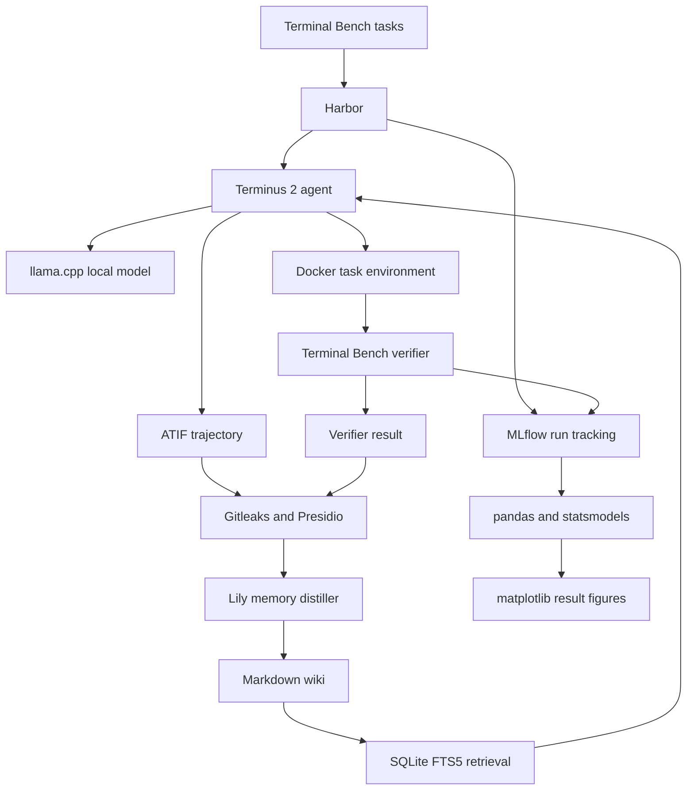

# Experiment Setup With Open Source Tools

**Experiment:** Terminal Artifact Memory  
**Status:** Planning guide  
**Last updated:** July 14 2026

## Purpose

This document defines the implementation stack for Experiment 01.

The guiding principle is:

> Reuse mature open source infrastructure for benchmarking, agents, model serving, observability, retrieval, security scanning, statistics, and reproducibility. Implement custom Lily code only where it represents the actual research contribution.

The research contribution is not a new benchmark runner, terminal agent, model server, search engine, or experiment dashboard. It is the verified memory layer and the measurement of whether that memory improves a fixed local model on structurally recurring terminal tasks.

## System overview



## Reuse versus custom implementation

| Experiment capability | Open source tool | Lily responsibility |
| --- | --- | --- |
| Benchmark tasks | Terminal Bench | Select tasks and preregister task families |
| Task orchestration | Harbor | Generate controlled M0 through M3 runs |
| Isolation | Docker | Define host safety policy and artifact export boundary |
| Terminal agent | Terminus 2 | Supply the fixed prompt and retrieved memory |
| Agent trajectory | Harbor ATIF | Read, sanitize, and transform the standard trajectory |
| Local inference | llama.cpp | Pin one model file and one runtime configuration |
| Secret detection | Gitleaks | Add experiment specific rules and enforce zero findings |
| PII detection | Microsoft Presidio | Add recognizers for paths, hostnames, repository names, and benchmark leakage |
| Lexical retrieval | SQLite FTS5 | Convert Markdown into indexed fields and construct the query |
| Run tracking | MLflow | Log Lily parameters, metrics, and artifacts consistently |
| Data analysis | pandas | Build paired run and task family tables |
| Statistical tests | statsmodels | Define the preregistered comparison and interpret the result |
| Visualization | matplotlib | Produce the Lily learning curve and failure analysis figures |
| Tests | pytest | Test Lily specific transformations, metrics, and safety rules |
| Dependency management | uv | Pin the Python environment and lock dependencies |
| Quality checks | Ruff and Pyright | Configure linting and static checks |
| Local checks | pre commit | Run the same safety and quality checks before a commit |
| Continuous integration | GitHub Actions | Reproduce the checks on every pull request |

## Components reused directly

### 1. Terminal Bench

Terminal Bench provides the terminal tasks, isolated task definitions, executable verifiers, and oracle material used only for harness validation.

Lily must not copy hidden tests, reference answers, verifier implementation details, or prohibited benchmark material into searchable memory.

The benchmark version and task revision must be pinned before the first measured run.

### 2. Harbor

Harbor is the experiment orchestrator. It should own:

1. Task environment creation.
2. Agent invocation.
3. Execution limits.
4. Verifier execution.
5. Trial directories.
6. Standard result artifacts.

Lily should not create a second benchmark scheduler around Harbor. A small coordinator may generate Harbor configurations for the memory conditions and checkpoints.

### 3. Docker

Every agent action executes inside the benchmark task container.

The host machine must never be exposed as the agent terminal. The only outputs copied from a completed task are the explicitly permitted trial artifacts required for evaluation and memory construction.

### 4. Terminus 2

Terminus 2 is the default terminal agent for the first experiment.

It supplies the terminal interaction loop, tool calls, observations, history handling, stopping behavior, and final response. Lily adds memory to its fixed input context rather than implementing another agent loop.

The formal run must pin:

1. Agent version.
2. System prompt version.
3. Maximum turns.
4. Wall clock limit.
5. Context limit.
6. Temperature.
7. Seed where supported.
8. Tool permissions.

### 5. Harbor ATIF

The Agent Trajectory Interchange Format is the raw record of model and terminal interaction.

Lily consumes the standard trajectory rather than defining a competing event format. A small post run extractor may add the final file diff, environment manifest, verifier result, and sanitizer report when they are not already present.

### 6. llama.cpp

llama.cpp serves one fixed local model through an OpenAI compatible endpoint.

The experiment manifest records:

```yaml
model_runtime:
  provider: llama_cpp
  model_path: models/fixed_model.gguf
  model_sha256: REQUIRED
  quantization: REQUIRED
  runtime_revision: REQUIRED
  context_size: REQUIRED
  temperature: 0
  seed: REQUIRED_WHERE_SUPPORTED
```

The model file must be downloaded once, hashed, and frozen. Model comparisons begin only after the memory effect is measured.

### 7. SQLite FTS5

SQLite FTS5 provides the first lexical retrieval baseline and built in BM25 ranking.

A suggested index is:

```sql
CREATE VIRTUAL TABLE wiki_index USING fts5(
    page_id UNINDEXED,
    title,
    problem_pattern,
    symptoms,
    environment_assumptions,
    diagnostic_sequence,
    verified_resolution,
    limitations
);
```

A fixed query returns the top K pages:

```sql
SELECT
    page_id,
    title,
    bm25(wiki_index) AS score
FROM wiki_index
WHERE wiki_index MATCH ?
ORDER BY score
LIMIT ?;
```

Embeddings and vector databases are excluded from the core pilot. They may be evaluated only after the lexical baseline is recorded.

### 8. Gitleaks and Presidio

Gitleaks scans for credentials, tokens, private keys, and other secret patterns.

Presidio detects and anonymizes personal information. Lily extends Presidio with custom recognizers for:

1. Local home and workspace paths.
2. Internal hostnames.
3. Private IP addresses.
4. Git remote URLs.
5. Private repository names.
6. Machine identifiers.
7. Docker mount paths.
8. Hidden test paths.
9. Reference solution paths.
10. Benchmark answer leakage.

Automated detection is not sufficient by itself. Every pilot artifact also passes allowlist validation and canary testing.

### 9. MLflow

MLflow is the run registry and artifact browser.

Each evaluation run logs:

1. Task identifier.
2. Task family.
3. Probe type.
4. Memory condition.
5. Memory checkpoint.
6. Model and runtime hashes.
7. Prompt version.
8. Retriever configuration.
9. Verifier result.
10. Latency and token use.
11. Retrieved page identifiers and ranks.
12. ATIF trajectory.
13. Sanitizer report.
14. Final result artifacts.

The initial experiment may use the local MLflow file store. A remote tracking server is unnecessary for the three task pilot.

### 10. pandas, statsmodels, and matplotlib

pandas creates paired M0 and M2 tables and task family summaries.

statsmodels performs paired binary analysis such as McNemar's test. The primary comparison uses the same probes in both conditions, so the runs must not be treated as independent samples.

matplotlib generates deterministic static figures from measured result tables.

## Lily specific components

Only the following components should be custom.

### 1. Task split and family registry

This file assigns each benchmark task to one role and one preregistered engineering pattern.

```text
benchmark/
  split.yaml
  task_families.yaml
```

It prevents memory contamination and establishes which probes measure exact recurrence, structural recurrence, and novel controls.

### 2. Memory distiller

The memory distiller converts a sanitized successful trajectory and verifier result into one structured Markdown page.

```text
ATIF trajectory
plus
verifier result
plus
final diff
becomes
verified Markdown memory
```

Each page records the problem pattern, symptoms, environment assumptions, diagnostic sequence, verified resolution, failed approaches, transfer boundaries, provenance, and freshness state.

This transformation is part of the research contribution and must remain inspectable.

### 3. Memory injection adapter

The adapter constructs the M2 context from the task instruction, currently observed failure information, and top K retrieved Markdown pages.

It must preserve one fixed prompt template and maximum retrieved token budget across all measured runs.

M0 uses the same template with the memory section empty.

### 4. Paired experiment coordinator

The coordinator produces controlled Harbor jobs for:

1. M0 with no memory.
2. M1 with sanitized evidence.
3. M2 with distilled Markdown memory.
4. M3 with evidence plus Markdown memory.

The core comparison is M0 versus M2. M1 and M3 are representation studies.

The coordinator verifies that model, agent, task, prompt, runtime, hardware, context limit, tool permissions, and execution budget remain fixed.

### 5. Results transformer

The results transformer reads Harbor and MLflow outputs and produces:

1. Structural recurrence learning curve.
2. Paired positive and negative transfer table.
3. Task family memory lift.
4. Verified knowledge yield.
5. Retrieval coverage.
6. Unsafe confident error analysis.
7. Latency and resource summaries.

It does not decide whether an execution succeeded. The Terminal Bench verifier remains authoritative.

## Suggested project structure

```text
01_terminal_artifact_memory/
  README.md
  SETUP.md
  experiment.yaml
  pyproject.toml
  uv.lock

  benchmark/
    split.yaml
    task_families.yaml
    harbor/

  prompts/
    terminus_system.md
    memory_context.md

  runtime/
    model.yaml
    hardware.yaml

  sanitizer/
    pipeline.py
    presidio_recognizers.py
    gitleaks.toml
    allowlist.yaml
    canaries.py

  memory/
    distill.py
    schema.py
    evidence/
    wiki/
    manifests/

  retrieval/
    index.py
    query.py
    wiki.db

  evaluation/
    coordinate.py
    transform_results.py
    statistics.py
    render_results.py

  results/
    README.md
    measured/
    figures/
```

Directories should be added only when the pilot needs them. Empty architecture should not be committed merely to match this diagram.

## Three task pilot

The pilot validates the complete path before scaling the experiment.

### Pilot scope

1. One preregistered engineering family.
2. Three memory build tasks.
3. Separate structural recurrence probes.
4. One pinned local model.
5. M0 and M2 only.
6. SQLite FTS5 retrieval with fixed top K.
7. Full manual review of every trajectory, memory page, retrieval result, and answer.

### Pilot sequence

1. Install and validate Harbor, Docker, and the Terminal Bench dataset.
2. Run an oracle task to validate the benchmark environment and verifier.
3. Start llama.cpp with the pinned model.
4. Run Terminus 2 against one task with no memory.
5. Confirm the ATIF trajectory and verifier result are preserved.
6. Run Gitleaks, Presidio, Lily recognizers, allowlist validation, and canary tests.
7. Distill one verified run into Markdown.
8. Index the page with SQLite FTS5.
9. Run the same preregistered structural probes under M0 and M2.
10. Log all runs and artifacts to MLflow.
11. Calculate positive transfer, negative transfer, retrieval coverage, and verified knowledge yield.
12. Render the first measured learning curve.

### Pilot continuation boundary

Continue to checkpoints 6, 9, and 12 only when:

1. The end to end pipeline is reproducible.
2. The verifier result is captured correctly.
3. No secret, private path, or benchmark leakage reaches memory.
4. Retrieved pages and prompt contents can be reconstructed for every run.
5. At least one structural probe shows a plausible measurable signal.
6. No ruin boundary is breached.

## Minimal dependency groups

The exact versions must be pinned when implementation starts.

```toml
[project]
dependencies = [
  "mlflow",
  "pandas",
  "pydantic",
  "presidio-analyzer",
  "presidio-anonymizer",
  "statsmodels",
]

[dependency-groups]
dev = [
  "pyright",
  "pytest",
  "ruff",
]
```

Harbor, Docker, llama.cpp, Gitleaks, and SQLite are system tools and should be pinned separately in the experiment manifest or setup scripts.

## Reproducibility manifest

Every measured run must identify:

```yaml
run_environment:
  code_revision: REQUIRED
  harbor_version: REQUIRED
  terminal_bench_version: REQUIRED
  task_container_digest: REQUIRED
  terminus_version: REQUIRED
  atif_schema_version: REQUIRED
  llama_cpp_revision: REQUIRED
  model_sha256: REQUIRED
  quantization: REQUIRED
  prompt_revision: REQUIRED
  retrieval_revision: REQUIRED
  sanitizer_revision: REQUIRED
  python_lock_hash: REQUIRED
  docker_version: REQUIRED
  operating_system: REQUIRED
  hardware_description: REQUIRED
```

A run missing one of the required controls is a development run and cannot be included in the primary result.

## Safety gates

Before an artifact enters searchable memory, all of the following must pass:

1. Terminal Bench verifier passed.
2. Artifact provenance is complete.
3. Gitleaks reports no unresolved finding.
4. Presidio and Lily recognizers complete successfully.
5. Canary values are detected and removed.
6. Hidden test and reference solution paths are absent.
7. The sanitized artifact matches the allowlist.
8. The distilled page links every operational claim to verified evidence.
9. A human reviews every artifact during the pilot.

A failure blocks the artifact from memory. It is not converted into a warning only.

## Tools deliberately deferred

The following tools are not required for the first experiment:

1. Vector databases.
2. Embedding models.
3. Neural rerankers.
4. Knowledge graphs.
5. Fine tuning frameworks.
6. Multiple model serving systems.
7. Kubernetes.
8. Distributed workflow schedulers.
9. Custom web dashboards.
10. OpenTelemetry infrastructure.
11. DVC for the initial small artifact set.
12. LiteLLM unless direct Harbor to llama.cpp compatibility fails.

Each deferred component must earn inclusion by improving a measured operational decision.

## Optional later additions

### LiteLLM

Add LiteLLM only when a stable compatibility layer is needed between Harbor agents and multiple local inference runtimes.

### DVC

Add DVC when model files, trajectories, or evidence bundles become too large for the chosen MLflow artifact store or require dataset versions independent of individual runs.

### Semantic retrieval

Add an embedding model and semantic index only after SQLite FTS5 establishes the lexical baseline. Compare them on the same frozen probes and report whether they improve held out structural recurrence without increasing negative transfer.

### Local sufficiency model

Add scikit learn logistic regression only after the core memory effect exists. Its target is the authoritative verifier result and its purpose is routing, not correctness judgment.

## Definition of implementation complete

The setup is ready for measured experimentation when:

1. Harbor can run the pinned Terminal Bench subset in Docker.
2. Terminus 2 can use the pinned local model through llama.cpp.
3. ATIF trajectories and verifier results are preserved.
4. Successful artifacts pass the complete sanitizer.
5. The memory distiller produces provenance linked Markdown.
6. SQLite FTS5 retrieves the expected pages under a frozen configuration.
7. The coordinator runs paired M0 and M2 probes with identical controls.
8. MLflow stores every parameter, metric, and artifact needed to reconstruct a run.
9. The result scripts reproduce the paired transfer table and primary learning curve.
10. The safety scan and test suite pass in pre commit and GitHub Actions.

At that point, the experiment can begin collecting evidence instead of building infrastructure.
