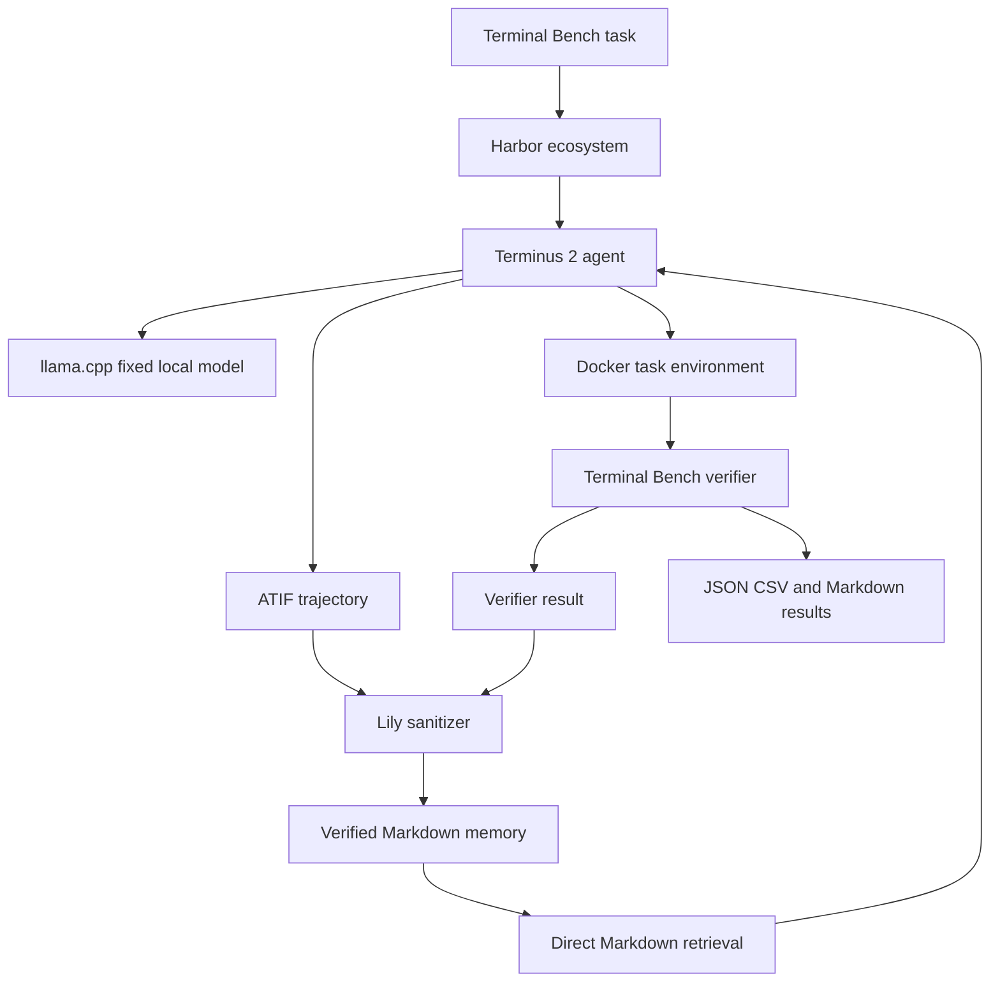

# Minimal Pilot Setup

**Experiment:** Terminal Artifact Memory  
**Status:** Pilot setup  
**Last updated:** July 14 2026

## Principle

Use the smallest credible setup that preserves four things:

1. Isolated terminal execution.
2. Authoritative task verification.
3. Safe verified memory.
4. Reproducible paired results.

The research contribution is the verified memory layer and the measurement of whether that memory improves one fixed local model on structurally recurring terminal tasks.

Lily does not need to become a benchmark platform, agent framework, model serving platform, database, experiment tracker, workflow system, or visualization system.

## Pilot question

Can verified artifacts from completed terminal tasks make one fixed lightweight local model increasingly useful on held out structurally recurring engineering problems?

The primary comparison is:

```text
M0: fixed local model with no memory
M2: the same fixed local model with retrieved Markdown memory
```

The model, prompt, runtime, hardware, context limit, tool permissions, task set, and execution budget remain fixed. Only the verified memory grows.

## Final pilot stack

The pilot uses four tools:

1. Harbor ecosystem
2. llama.cpp
3. uv
4. Gitleaks

Python and Git are assumed foundations rather than experiment tools.

Everything else must earn inclusion by solving an observed problem in the pilot.

## Lean architecture



## 1. Harbor ecosystem

Treat Terminal Bench, Harbor, Terminus 2, ATIF, Docker isolation, and the executable verifier as one platform decision.

Harbor provides:

1. Terminal Bench task execution.
2. Docker task environment creation.
3. Terminus 2 agent invocation.
4. Execution limits.
5. ATIF trajectory capture.
6. Terminal Bench verifier execution.
7. Standard trial artifacts.

Lily must not create another benchmark scheduler, terminal agent loop, verifier, trajectory format, or container orchestration layer.

Docker remains necessary for isolation, but Lily interacts with it through Harbor rather than maintaining separate Docker infrastructure.

## 2. llama.cpp

llama.cpp serves one fixed local model through an OpenAI compatible endpoint.

No additional model gateway is required.

The pilot manifest records:

```yaml
model:
  runtime: llama_cpp
  model_path: models/fixed_model.gguf
  model_sha256: REQUIRED
  quantization: REQUIRED
  runtime_revision: REQUIRED
  context_size: REQUIRED
  temperature: 0
  seed: REQUIRED_WHERE_SUPPORTED
```

Download the model once, record its hash, and freeze it before measured runs begin.

Do not compare models until the memory effect has been measured.

## 3. uv

uv manages the Python version, environment, lock file, and script execution.

The pilot uses only the Python standard library, so the project has no required Python package dependencies.

```toml
[project]
name = "terminal-artifact-memory"
version = "0.1.0"
requires-python = ">=3.12"
dependencies = []
```

Use Python standard library modules for JSON, CSV, Markdown generation, hashing, file traversal, lexical scoring, regular expressions, subprocess execution, statistics, and tests.

Testing uses `unittest`.

Do not add pip requirement files, task runners, hook frameworks, dataframe libraries, statistics packages, or plotting packages for the pilot.

## 4. Gitleaks

Gitleaks scans every exported artifact before it can enter searchable memory.

Lily adds a small transparent sanitizer for experiment specific content:

1. Home directory paths.
2. Workspace paths.
3. Repository names.
4. Git remote addresses.
5. Hostnames.
6. Private network addresses.
7. Docker mount paths.
8. Hidden test paths.
9. Reference solution paths.
10. Canary strings.

Every accepted artifact also receives manual review during the pilot.

The pilot does not need a general personal information platform.

## Direct Markdown retrieval

The pilot does not need SQLite, embeddings, or a vector database.

The retriever performs a deterministic file scan:

1. Read every page in `memory/wiki/`.
2. Extract the fixed searchable fields.
3. Normalize and tokenize the current task description.
4. Score each page with one documented lexical rule.
5. Return the top K pages within a fixed token budget.
6. Record every retrieved page identifier and score.

This is the simplest retrieval baseline. More advanced retrieval is considered only after the baseline produces measured results.

## Minimal Lily code

```text
01_terminal_artifact_memory/
  README.md
  SETUP.md
  pyproject.toml
  uv.lock

  lily/
    experiment.py
    sanitize.py
    memory.py
    analyze.py

  prompts/
    system.md
    memory.md

  memory/
    wiki/

  runs/
  results/
```

Add a directory only when the pilot actually needs it.

### experiment.py

Runs controlled Harbor jobs for M0 and M2.

It verifies that every non memory control remains identical and creates one self contained run directory for each trial.

### sanitize.py

Reads exported trial artifacts, invokes Gitleaks, applies Lily redaction rules, validates the allowlist, tests canaries, and writes a sanitizer report.

### memory.py

Converts one sanitized successful trajectory and verifier result into a provenance linked Markdown page.

It also performs deterministic direct retrieval over the Markdown wiki.

### analyze.py

Reads paired JSON results and writes:

1. `results.csv`
2. `summary.md`
3. `paired_transfer_table.md`

The summary reports:

1. Structural recurrence pass rates.
2. Positive transfer count.
3. Negative transfer count.
4. Stable success count.
5. Unresolved task count.
6. Retrieval coverage.
7. Verified knowledge yield.

Terminal Bench remains the authority on whether a task passed.

Charts are presentation artifacts and are not part of the pilot runtime. They may be created later from `results.csv` using any suitable tool.

## Where the system runs

### Laptop

Start on the laptop.

Use it for:

1. Writing and reviewing code.
2. Running standard library tests.
3. Running sanitizer self tests.
4. Running small development trials.
5. Reviewing every artifact before it enters memory.
6. Inspecting JSON, CSV, and Markdown results.

### VPS

The VPS is optional capacity rather than part of the architecture.

Use it only when local trials become too long or resource intensive.

The VPS must use the same Git revision, uv lock file, model hash, prompt revision, and pinned system tool versions as the laptop.

### GitHub

GitHub stores code, documentation, prompts, manifests, and reviewed result summaries.

GitHub Actions is not required.

Large raw artifacts may remain on the laptop or VPS. Commit only reviewed summaries and compact measured results.

## Run storage

Do not introduce an experiment tracking service.

Each trial is a self contained directory:

```text
runs/
  2026_07_14_001/
    manifest.json
    trajectory.json
    verifier.json
    retrieval.json
    sanitizer.json
    result.json
```

A measured trial must be reconstructable from its directory and referenced Git revision.

## Reproducibility manifest

Every measured trial records:

```yaml
run_environment:
  code_revision: REQUIRED
  harbor_version: REQUIRED
  terminal_bench_version: REQUIRED
  task_container_digest: REQUIRED
  terminus_version: REQUIRED
  atif_schema_version: REQUIRED
  llama_cpp_revision: REQUIRED
  model_sha256: REQUIRED
  quantization: REQUIRED
  prompt_revision: REQUIRED
  retrieval_revision: REQUIRED
  sanitizer_revision: REQUIRED
  python_lock_hash: REQUIRED
  operating_system: REQUIRED
  hardware_description: REQUIRED
```

A trial missing a required control is a development trial and cannot enter the primary result.

## Commands

Prepare the Python environment:

```bash
uv sync
```

Run tests and safety checks:

```bash
uv run python -m unittest
gitleaks detect
uv run python lily/sanitize.py --self-test
```

Run paired trials:

```bash
uv run python lily/experiment.py
```

Produce result files:

```bash
uv run python lily/analyze.py
```

No Makefile, pre commit framework, hosted workflow, database, tracking server, or visualization package is required.

## Pilot sequence

1. Install Harbor, llama.cpp, uv, and Gitleaks.
2. Pin the Terminal Bench task revision and Harbor ecosystem versions.
3. Download, hash, and freeze one local model.
4. Run one oracle task to validate the task environment and verifier.
5. Run one Terminus 2 task under M0.
6. Confirm that the ATIF trajectory and verifier result are preserved.
7. Run Gitleaks, Lily redaction rules, allowlist validation, and canary tests.
8. Manually review the exported artifact.
9. Distill one verified run into a Markdown memory page.
10. Retrieve relevant pages using the frozen direct file scan.
11. Run the same held out probes under M0 and M2.
12. Store each trial in a self contained run directory.
13. Generate the paired CSV and Markdown results.
14. Decide whether the measured signal justifies scaling the experiment.

## Safety gate

Before an artifact enters searchable memory, all conditions must pass:

1. The Terminal Bench verifier passed.
2. Artifact provenance is complete.
3. Gitleaks reports no unresolved finding.
4. Lily sanitizer rules complete successfully.
5. Canary values are detected and removed.
6. Hidden test and reference solution paths are absent.
7. The sanitized artifact matches the explicit allowlist.
8. Operational claims in the Markdown page link to verified evidence.
9. A human reviewed the artifact.

A failed gate blocks the artifact from memory.

## Excluded from the pilot

The first credible experiment does not require:

1. matplotlib or another plotting package.
2. GitHub Actions.
3. MLflow.
4. Presidio.
5. pandas.
6. statsmodels.
7. pytest.
8. Pyright.
9. pre commit.
10. SQLite FTS5.
11. Vector databases.
12. Embedding models.
13. Neural rerankers.
14. Knowledge graphs.
15. Fine tuning frameworks.
16. Multiple model serving systems.
17. LiteLLM.
18. DVC.
19. Kubernetes.
20. Distributed workflow schedulers.
21. Custom dashboards.
22. OpenTelemetry infrastructure.

A new tool must solve an observed problem or improve a measured decision before it is added.

## When to add infrastructure

Add a plotting tool only when the measured CSV result needs a publication quality figure.

Add SQLite only when direct Markdown scanning becomes operationally inconvenient.

Add semantic retrieval only after the direct lexical baseline is frozen and the same probes demonstrate measurable improvement.

Add pytest only when the standard library tests become awkward to maintain.

Add pandas only when result manipulation becomes difficult with JSON, CSV, and the standard library.

Add statsmodels only when the evaluation set is large enough for a preregistered statistical test to be meaningful.

Add MLflow only when self contained run directories become difficult to compare across several models, machines, or researchers.

Add GitHub Actions only when several contributors need automatic clean environment checks.

## Definition of pilot ready

The setup is ready for measured experimentation when:

1. Harbor runs the pinned Terminal Bench subset in Docker.
2. Terminus 2 uses the pinned local model through llama.cpp.
3. ATIF trajectories and verifier results are preserved.
4. Successful artifacts pass Gitleaks, the Lily sanitizer, canary tests, allowlist validation, and manual review.
5. The memory script produces provenance linked Markdown.
6. Direct Markdown retrieval returns the expected pages under a frozen configuration.
7. The experiment script runs paired M0 and M2 probes with identical controls.
8. Every measured trial is reconstructable from its run directory.
9. The analysis script reproduces the paired CSV and Markdown result files.

At that point, Lily can begin collecting evidence instead of building infrastructure.