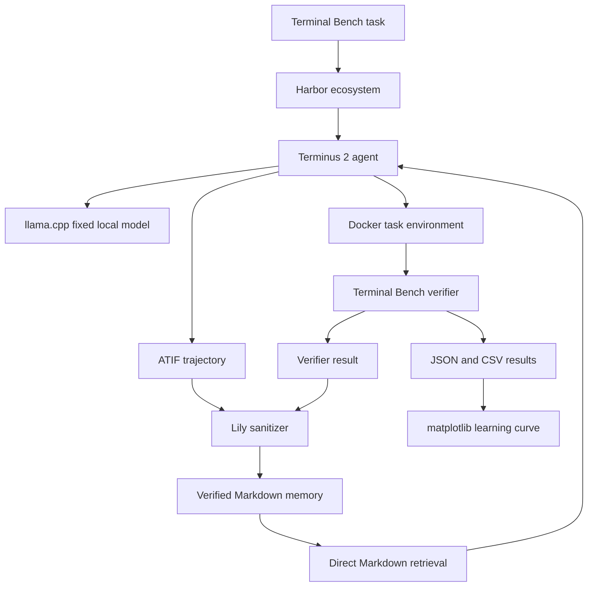

# Minimal Experiment Setup

**Experiment:** Terminal Artifact Memory  
**Status:** Pilot setup  
**Last updated:** July 14 2026

## Principle

Use the smallest credible stack that can preserve isolation, verification, artifact safety, reproducibility, and the primary result.

A tool belongs in the pilot only when removing it would weaken one of those five properties.

The research contribution is not a new benchmark runner, agent framework, model server, database, experiment tracker, or workflow system. It is the verified memory layer and the measurement of whether that memory improves one fixed local model on structurally recurring terminal tasks.

## Pilot question

Can verified artifacts from completed terminal tasks make one fixed lightweight local model increasingly useful on held out structurally recurring engineering problems?

The core comparison is:

```text
M0: fixed local model with no memory
M2: the same fixed local model with retrieved Markdown memory
```

The model, prompt, runtime, hardware, context limit, tool permissions, and execution budget remain fixed. Only the verified memory grows.

## Final pilot stack

The pilot uses five tools.

1. Harbor ecosystem
2. llama.cpp
3. uv
4. Gitleaks
5. matplotlib

Python and Git are assumed foundations rather than experiment tools.

## Lean architecture



## 1. Harbor ecosystem

Treat Terminal Bench, Harbor, Terminus 2, ATIF, Docker isolation, and the executable verifier as one platform decision.

Harbor should provide:

1. Terminal Bench task execution.
2. Docker task environment creation.
3. Terminus 2 agent invocation.
4. Execution limits.
5. ATIF trajectory capture.
6. Terminal Bench verifier execution.
7. Standard trial artifacts.

Lily should not create another benchmark scheduler, terminal agent loop, verifier, trajectory format, or container orchestration layer.

Docker remains necessary for isolation, but Lily should interact with it through Harbor rather than maintain separate Docker infrastructure.

## 2. llama.cpp

llama.cpp serves one fixed local model through an OpenAI compatible endpoint.

No additional model gateway is required for the pilot.

The manifest records:

```yaml
model:
  runtime: llama_cpp
  model_path: models/fixed_model.gguf
  model_sha256: REQUIRED
  quantization: REQUIRED
  runtime_revision: REQUIRED
  context_size: REQUIRED
  temperature: 0
  seed: REQUIRED_WHERE_SUPPORTED
```

The model file is downloaded once, hashed, and frozen before measured runs begin.

Model comparisons begin only after the memory effect has been measured.

## 3. uv

uv manages the Python environment, lock file, dependency installation, and script execution.

The pilot should not use separate virtual environment instructions, pip requirement files, task runners, or hook frameworks.

The dependency file can remain minimal:

```toml
[project]
dependencies = [
  "matplotlib",
]
```

Testing uses Python standard library `unittest`.

## 4. Gitleaks

Gitleaks scans exported artifacts before they enter searchable memory.

Lily adds a small transparent sanitizer for experiment specific content such as:

1. Home directory paths.
2. Workspace paths.
3. Repository names.
4. Git remote addresses.
5. Hostnames.
6. Private network addresses.
7. Docker mount paths.
8. Hidden test paths.
9. Reference solution paths.
10. Canary strings.

The pilot does not need a general purpose personal information platform. Every accepted artifact also receives manual review.

## 5. matplotlib

matplotlib produces the primary learning curve and any compact supporting figures.

The Python standard library handles JSON, CSV, hashing, statistics, file traversal, regular expressions, subprocess execution, and tests.

## Direct Markdown retrieval

The pilot does not need SQLite, embeddings, or a vector database.

The memory retriever should:

1. Read every Markdown page in `memory/wiki/`.
2. Extract deterministic searchable fields.
3. Tokenize the current task description.
4. Score pages using a simple fixed lexical rule.
5. Return the top K pages within a fixed token budget.
6. Record the retrieved page identifiers and scores.

This direct file scan is both the simplest implementation and the baseline the experiment should beat before more advanced retrieval is considered.

## Minimal Lily code

```text
01_terminal_artifact_memory/
  README.md
  SETUP.md
  pyproject.toml
  uv.lock

  lily/
    experiment.py
    sanitize.py
    memory.py
    analyze.py

  prompts/
    system.md
    memory.md

  memory/
    wiki/

  runs/
  results/
```

Directories should be added only when the pilot actually needs them.

### experiment.py

Runs controlled Harbor jobs for M0 and M2.

It verifies that all non memory controls remain identical and stores one self contained run directory for each trial.

### sanitize.py

Reads exported trial artifacts, invokes Gitleaks, applies Lily redaction rules, validates the allowlist, tests canaries, and writes a sanitizer report.

### memory.py

Converts one sanitized successful trajectory and verifier result into a provenance linked Markdown page.

It also performs deterministic direct file retrieval over the Markdown wiki.

### analyze.py

Reads paired JSON results and produces:

1. Structural recurrence pass rates.
2. Positive transfer count.
3. Negative transfer count.
4. Stable success count.
5. Unresolved task count.
6. Retrieval coverage.
7. Verified knowledge yield.
8. The primary learning curve.

Terminal Bench remains the authority on whether a task passed.

## Where the system runs

### Laptop

Start on the laptop.

Use it for:

1. Writing and reviewing code.
2. Running standard library tests.
3. Running sanitizer self tests.
4. Running small development trials.
5. Reviewing every pilot artifact before it enters memory.
6. Inspecting and plotting results.

### VPS

The VPS is optional capacity rather than part of the architecture.

Use it only when local runs become too long or resource intensive.

The VPS uses the same Git revision, uv lock file, model hash, prompt revision, and pinned system tool versions as the laptop.

### GitHub

GitHub stores code, documentation, prompts, manifests, and reviewed result summaries.

GitHub Actions is not required for the pilot.

Large raw artifacts may remain on the laptop or VPS. Only reviewed summaries and compact measured results should be committed.

## Run storage

Do not introduce an experiment tracking service for the pilot.

Each run is a self contained directory:

```text
runs/
  2026_07_14_001/
    manifest.json
    trajectory.json
    verifier.json
    retrieval.json
    sanitizer.json
    result.json
```

A measured run must be reconstructable from its directory and the referenced Git revision.

## Reproducibility manifest

Every measured run records:

```yaml
run_environment:
  code_revision: REQUIRED
  harbor_version: REQUIRED
  terminal_bench_version: REQUIRED
  task_container_digest: REQUIRED
  terminus_version: REQUIRED
  atif_schema_version: REQUIRED
  llama_cpp_revision: REQUIRED
  model_sha256: REQUIRED
  quantization: REQUIRED
  prompt_revision: REQUIRED
  retrieval_revision: REQUIRED
  sanitizer_revision: REQUIRED
  python_lock_hash: REQUIRED
  operating_system: REQUIRED
  hardware_description: REQUIRED
```

A run missing a required control is a development run and cannot enter the primary result.

## Local commands

Run the same commands on the laptop and VPS:

```bash
uv sync
uv run python -m unittest

gitleaks detect
uv run python lily/sanitize.py --self-test
```

Run the experiment:

```bash
uv run python lily/experiment.py
```

Produce the measured result:

```bash
uv run python lily/analyze.py
```

No Makefile, pre commit framework, or hosted workflow is required for the pilot.

## Pilot sequence

1. Install Harbor, llama.cpp, uv, and Gitleaks.
2. Pin the Terminal Bench task revision and Harbor ecosystem versions.
3. Download, hash, and freeze one local model.
4. Run one oracle task to validate the environment and verifier.
5. Run one Terminus 2 task with no memory.
6. Confirm that the ATIF trajectory and verifier result are preserved.
7. Run Gitleaks, Lily redaction rules, allowlist validation, and canary tests.
8. Manually review the exported artifact.
9. Distill one verified run into a Markdown memory page.
10. Retrieve relevant pages using the fixed direct file scan.
11. Run the same held out probes under M0 and M2.
12. Store each run in a self contained run directory.
13. Produce paired transfer counts and the first measured learning curve.

## Safety gate

Before an artifact enters searchable memory, all of the following must pass:

1. The Terminal Bench verifier passed.
2. Artifact provenance is complete.
3. Gitleaks reports no unresolved finding.
4. Lily sanitizer rules complete successfully.
5. Canary values are detected and removed.
6. Hidden test and reference solution paths are absent.
7. The sanitized artifact matches the explicit allowlist.
8. Operational claims in the Markdown page link to verified evidence.
9. A human reviewed the artifact.

A failed gate blocks the artifact from memory.

## Tools deliberately excluded from the pilot

The first credible experiment does not require:

1. GitHub Actions.
2. MLflow.
3. Presidio.
4. pandas.
5. statsmodels.
6. pytest.
7. Pyright.
8. pre commit.
9. SQLite FTS5.
10. Vector databases.
11. Embedding models.
12. Neural rerankers.
13. Knowledge graphs.
14. Fine tuning frameworks.
15. Multiple model serving systems.
16. LiteLLM.
17. DVC.
18. Kubernetes.
19. Distributed workflow schedulers.
20. Custom dashboards.
21. OpenTelemetry infrastructure.

A new tool must solve an observed problem or improve a measured decision before it is added.

## When to add more infrastructure

Add SQLite only when direct Markdown scanning becomes operationally inconvenient.

Add semantic retrieval only after the direct lexical baseline is frozen and the same probes show a measurable improvement.

Add pytest only when the standard library test suite becomes awkward to maintain.

Add pandas only when result manipulation becomes difficult with JSON, CSV, and the standard library.

Add statsmodels only when the evaluation set is large enough for a preregistered statistical test to be meaningful.

Add MLflow only when self contained run directories become difficult to compare across several models, machines, or researchers.

Add GitHub Actions only when several contributors need automatic clean environment checks.

## Definition of pilot ready

The setup is ready for measured experimentation when:

1. Harbor can run the pinned Terminal Bench subset in Docker.
2. Terminus 2 can use the pinned local model through llama.cpp.
3. ATIF trajectories and verifier results are preserved.
4. Successful artifacts pass Gitleaks, the Lily sanitizer, canary tests, allowlist validation, and manual review.
5. The memory distiller produces provenance linked Markdown.
6. Direct Markdown retrieval returns the expected pages under a frozen configuration.
7. The experiment script runs paired M0 and M2 probes with identical controls.
8. Every measured run is reconstructable from its run directory.
9. The analysis script reproduces the paired transfer counts and primary learning curve.

At that point, Lily can begin collecting evidence instead of building infrastructure.
