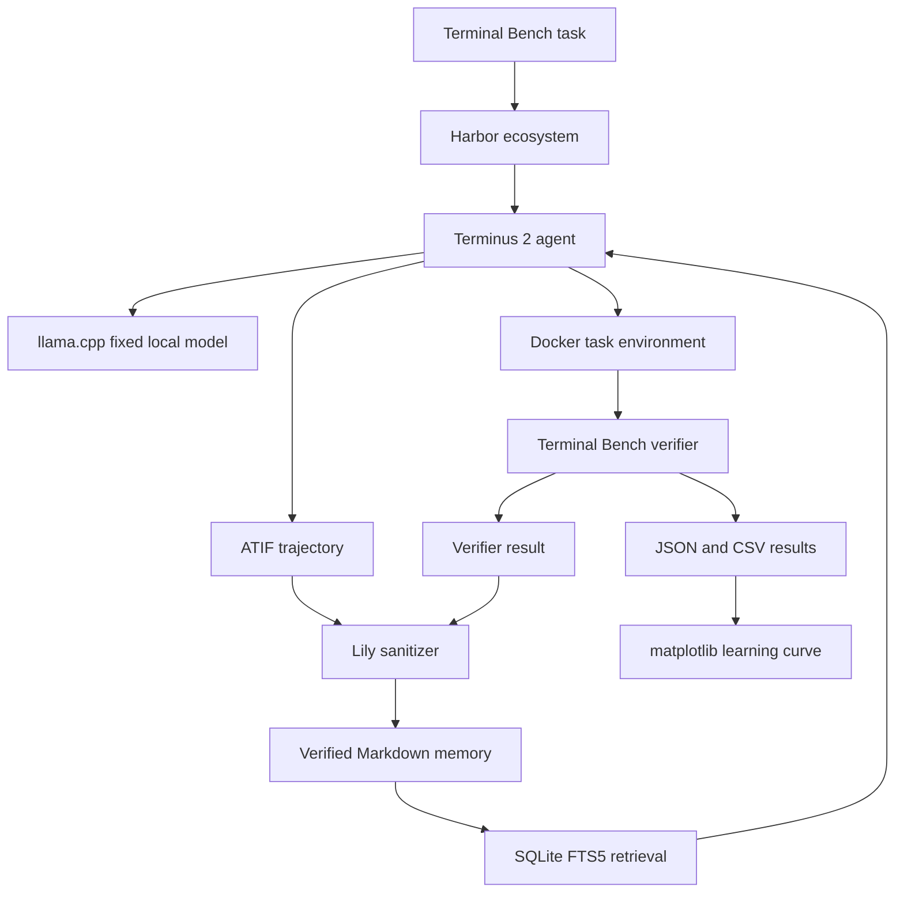

# Lean Experiment Setup

**Experiment:** Terminal Artifact Memory  
**Status:** Pilot setup  
**Last updated:** July 14 2026

## Principle

The pilot should use the fewest tools needed to protect the validity of the result.

A tool belongs in the setup only when it does at least one of the following:

1. Provides the benchmark and authoritative verifier.
2. Isolates agent execution from the host.
3. Runs the fixed local model.
4. Prevents unsafe or contaminated artifacts from entering memory.
5. Makes a measured run reproducible.
6. Produces the primary result.

The research contribution is the verified memory layer and the measurement of whether it improves a fixed local model on structurally recurring terminal tasks. Lily does not need to become a general agent platform, model serving platform, experiment tracker, or workflow system.

## Pilot question

Can verified artifacts from completed terminal tasks make one fixed lightweight local model increasingly useful on held out structurally recurring engineering problems?

The core comparison is:

```text
M0: fixed local model with no memory
M2: the same fixed local model with retrieved Markdown memory
```

The model, prompt, runtime, hardware, context limit, tool permissions, and execution budget remain fixed. Only the verified memory grows.

## Lean architecture



## Where the system runs

### Laptop

Use the laptop for:

1. Writing and reviewing Lily code.
2. Running unit tests.
3. Running sanitizer self tests.
4. Performing small development runs.
5. Reviewing every pilot artifact before it enters memory.
6. Inspecting and plotting results.

### VPS

Use the VPS for:

1. Long running Terminal Bench trials.
2. Repeated M0 and M2 evaluation runs.
3. Storing run directories and experiment artifacts.
4. Running the same checks used on the laptop.

The laptop and VPS use the same locked Python environment and the same pinned system tool versions.

### GitHub

GitHub stores code, documentation, prompts, manifests, and reviewed result summaries.

GitHub Actions is not required for the pilot. The experiment runs on the laptop or VPS. Hosted CI may be added later when several contributors are working on the repository or when clean environment checks provide clear operational value.

## Tools retained for the pilot

### 1. Harbor ecosystem

Treat Terminal Bench, Harbor, Terminus 2, and ATIF as one platform decision.

Harbor should provide:

1. Terminal Bench task execution.
2. Docker task environment creation.
3. Terminus 2 agent invocation.
4. Execution limits.
5. ATIF trajectory capture.
6. Terminal Bench verifier execution.
7. Standard trial artifacts.

Lily should not create another benchmark scheduler, terminal agent loop, verifier, or trajectory format.

### 2. Docker

Every agent action runs inside the benchmark task container.

The host machine must never be exposed as the agent terminal. Only explicitly permitted artifacts may leave the task container.

### 3. llama.cpp

llama.cpp serves one fixed local model through an OpenAI compatible endpoint.

The pilot manifest records:

```yaml
model:
  runtime: llama_cpp
  model_path: models/fixed_model.gguf
  model_sha256: REQUIRED
  quantization: REQUIRED
  runtime_revision: REQUIRED
  context_size: REQUIRED
  temperature: 0
  seed: REQUIRED_WHERE_SUPPORTED
```

The model file is downloaded once, hashed, and frozen. Model comparisons begin only after the memory effect has been measured.

### 4. Python standard library

Use the Python standard library for:

1. JSON manifests and run records.
2. CSV result tables.
3. File and directory management.
4. Hashing.
5. Regular expression based artifact redaction.
6. Experiment coordination.
7. Basic paired outcome counting.

Do not add a framework where a small inspectable script is sufficient.

### 5. SQLite FTS5

SQLite FTS5 provides the first retrieval baseline with built in BM25 ranking.

```sql
CREATE VIRTUAL TABLE wiki_index USING fts5(
    page_id UNINDEXED,
    title,
    problem_pattern,
    symptoms,
    environment_assumptions,
    diagnostic_sequence,
    verified_resolution,
    limitations
);
```

A fixed query returns the top K pages. Embeddings and vector databases are excluded from the pilot.

### 6. Gitleaks

Gitleaks scans exported artifacts for credentials, tokens, private keys, and related secret patterns.

A Gitleaks finding blocks the artifact from entering memory until it is resolved.

### 7. Lily sanitizer

One small Python sanitizer handles experiment specific contamination risks that generic secret scanners do not understand.

It must detect and remove:

1. Home and workspace paths.
2. Internal hostnames.
3. Private network addresses.
4. Git remote addresses.
5. Private repository names.
6. Machine identifiers.
7. Docker mount paths.
8. Hidden test paths.
9. Reference solution paths.
10. Benchmark answer leakage.
11. Canary values inserted by the safety tests.

Every pilot artifact also receives manual review before it enters searchable memory.

### 8. pytest

pytest tests only Lily specific behavior:

1. Sanitizer rules.
2. Canary detection.
3. Artifact allowlist enforcement.
4. Memory schema validation.
5. Retrieval determinism.
6. M0 and M2 configuration equivalence.
7. Result calculations.

### 9. uv

uv manages and locks the small Python environment.

### 10. matplotlib

matplotlib produces the primary structural recurrence learning curve and small supporting figures from measured CSV results.

## Minimal Python dependencies

The exact versions are pinned when implementation begins.

```toml
[project]
dependencies = [
    "matplotlib",
]

[dependency-groups]
dev = [
    "pytest",
]
```

Harbor, Docker, llama.cpp, Gitleaks, and SQLite are system tools and are pinned in the experiment manifest or setup script.

## Lily code

The initial implementation should remain small enough to inspect directly.

```text
01_terminal_artifact_memory/
  README.md
  SETUP.md
  experiment.yaml
  pyproject.toml
  uv.lock

  prompts/
    terminus_system.md
    memory_context.md

  benchmark/
    split.yaml
    task_families.yaml

  lily/
    experiment.py
    sanitize.py
    memory.py
    analyze.py

  memory/
    wiki/
    index.db

  runs/
  results/
```

Directories should be added only when the pilot actually needs them.

### experiment.py

Runs controlled Harbor jobs for M0 and M2 and verifies that all non memory controls remain identical.

### sanitize.py

Reads exported trial artifacts, runs the Lily redaction rules, invokes Gitleaks, validates the allowlist, tests canaries, and produces a sanitizer report.

### memory.py

Converts a sanitized successful trajectory and verifier result into one provenance linked Markdown page. It also builds and queries the SQLite FTS5 index.

### analyze.py

Reads paired run results and produces:

1. Structural recurrence pass rates.
2. Positive transfer count.
3. Negative transfer count.
4. Stable success count.
5. Unresolved task count.
6. Retrieval coverage.
7. Verified knowledge yield.
8. The primary learning curve.

Terminal Bench remains the authority on whether a task passed.

## Run storage

Do not introduce an experiment tracking service for the pilot.

Each run is a self contained directory:

```text
runs/
  2026_07_14_001/
    manifest.json
    trajectory.json
    verifier.json
    retrieval.json
    sanitizer.json
    result.json
```

A measured run must be reconstructable from its directory and the referenced Git revision.

Large raw artifacts may remain on the VPS. Reviewed summaries and compact measured results may be committed to GitHub.

## Reproducibility manifest

Every measured run records:

```yaml
run_environment:
  code_revision: REQUIRED
  harbor_version: REQUIRED
  terminal_bench_version: REQUIRED
  task_container_digest: REQUIRED
  terminus_version: REQUIRED
  atif_schema_version: REQUIRED
  llama_cpp_revision: REQUIRED
  model_sha256: REQUIRED
  quantization: REQUIRED
  prompt_revision: REQUIRED
  retrieval_revision: REQUIRED
  sanitizer_revision: REQUIRED
  python_lock_hash: REQUIRED
  docker_version: REQUIRED
  operating_system: REQUIRED
  hardware_description: REQUIRED
```

A run missing a required control is a development run and cannot enter the primary result.

## Local checks

Run the same checks on the laptop and VPS:

```bash
uv sync
uv run pytest
gitleaks detect
uv run python lily/sanitize.py --self-test
```

These commands may later be wrapped in one small shell script or Make target. A separate local hook framework is unnecessary for the pilot.

## Pilot sequence

1. Install Harbor, Docker, llama.cpp, Gitleaks, uv, and SQLite on the selected machine.
2. Pin the Terminal Bench task revision and the Harbor ecosystem versions.
3. Download, hash, and freeze one local model.
4. Run one oracle task to validate the environment and verifier.
5. Run one Terminus 2 task with no memory.
6. Confirm that the ATIF trajectory and verifier result are preserved.
7. Run Gitleaks, Lily redaction rules, allowlist validation, and canary tests.
8. Manually review the exported artifact.
9. Distill one verified run into a Markdown memory page.
10. Index that page with SQLite FTS5.
11. Run the same held out probes under M0 and M2.
12. Store each run in a self contained run directory.
13. Produce the paired transfer counts and first measured learning curve.

## Safety gate

Before an artifact enters searchable memory, all of the following must pass:

1. The Terminal Bench verifier passed.
2. Artifact provenance is complete.
3. Gitleaks reports no unresolved finding.
4. Lily sanitizer rules complete successfully.
5. Canary values are detected and removed.
6. Hidden test and reference solution paths are absent.
7. The sanitized artifact matches the explicit allowlist.
8. Operational claims in the Markdown page link to verified evidence.
9. A human reviewed the artifact.

A failed gate blocks the artifact from memory.

## Tools deliberately deferred

The following tools are not required for the first credible experiment:

1. GitHub Actions.
2. MLflow.
3. Presidio.
4. pandas.
5. statsmodels.
6. Pyright.
7. pre commit.
8. Vector databases.
9. Embedding models.
10. Neural rerankers.
11. Knowledge graphs.
12. Fine tuning frameworks.
13. Multiple model serving systems.
14. LiteLLM.
15. DVC.
16. Kubernetes.
17. Distributed workflow schedulers.
18. Custom dashboards.
19. OpenTelemetry infrastructure.

A deferred tool must earn inclusion by solving an observed problem or improving a measured decision.

## When to add more infrastructure

Add GitHub Actions when several contributors need automatic clean environment checks.

Add MLflow when run directories become difficult to compare or several models and machines are active.

Add pandas when result manipulation becomes awkward with CSV and the standard library.

Add statsmodels when the evaluation set is large enough for a preregistered statistical test to be meaningful.

Add Presidio when artifacts include real human conversations, customer information, or heterogeneous documents.

Add semantic retrieval only after SQLite FTS5 establishes the lexical baseline and the same frozen probes demonstrate a measurable benefit.

## Definition of pilot ready

The setup is ready for measured experimentation when:

1. Harbor can run the pinned Terminal Bench subset in Docker.
2. Terminus 2 can use the pinned local model through llama.cpp.
3. ATIF trajectories and verifier results are preserved.
4. Successful artifacts pass Gitleaks, the Lily sanitizer, canary tests, allowlist validation, and manual review.
5. The memory distiller produces provenance linked Markdown.
6. SQLite FTS5 retrieves the expected pages under a frozen configuration.
7. The coordinator runs paired M0 and M2 probes with identical controls.
8. Every run is reconstructable from its run directory and manifest.
9. The analysis script reproduces the paired transfer counts and primary learning curve.

At that point Lily should collect evidence rather than build more infrastructure.