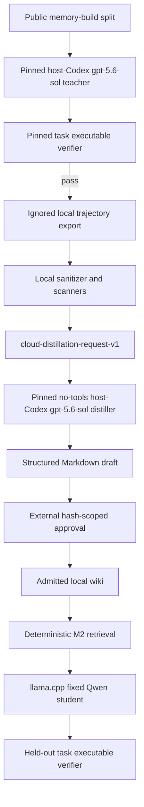

# Teacher/student transfer setup

**Experiment:** Terminal Artifact Memory
**Status:** Preregistered; qualified pilot awaiting post-merge measured execution
**Last updated:** August 1 2026

## Principle

Use the smallest auditable boundary that preserves:

1. an exact cloud teacher and distiller;
2. task-specific executable-verifier authority and qualification;
3. local privacy and contamination gates;
4. hash-scoped external approval;
5. an exact local student and disjoint paired evaluation; and
6. complete disclosure and provenance records.

> **Do not claim success; the executable verifier alone determines whether the run is eligible for local sanitization and later distillation.**

Model confidence, narrative, apparent tool exits, and distillation quality are never eligibility signals.

## Fixed roles and tools

- **Cloud teacher/distiller:** `gpt-5.6-sol` through pinned host Codex CLI 0.146.0. The teacher uses `host-codex-subscription-task-mcp-v1`; each distiller uses a separate fresh no-tools session. OAuth remains on the host.
- **Local student:** Apache-2.0 `Qwen/Qwen2.5-Coder-7B-Instruct-GGUF` at Hugging Face revision `13fb94bfda8c8cf22497dc57b78f391a9acb426a`, Q4_K_M, SHA-256 `509287f78cb4d4cf6b3843734733b914b2c158e43e22a7f4bf5e963800894d3c`.
- **Harbor/Terminal Bench:** isolated tasks, Terminus-2 student agent, ATIF transport, Docker environment, and task executable verifier.
- **llama.cpp:** serves the one fixed local Qwen through a loopback endpoint.
- **Gitleaks plus `artifact_memory.sanitize`:** local secret, privacy, canary, contamination, blocked-term, allowlist, and residual gates.
- **uv/Python standard library:** reproducible local implementation and tests.

The frozen student policy is 32,768 context tokens, no summarization, and a 24-turn cap. Three disjoint development tasks reached executable verification while leaving at least 17,203 tokens after reserving the 1,800-token M2 budget. The old 16,384-token policy remains only in the immutable halted report.

## Architecture


```mermaid
flowchart TD
    A[Public memory-build split] --> B[Pinned host-Codex gpt-5.6-sol teacher]
    B --> C[Pinned task executable verifier]
    C -->|pass| D[Ignored local trajectory export]
    D --> E[Local sanitizer and scanners]
    E --> F[cloud-distillation-request-v1]
    F --> G[Pinned no-tools host-Codex gpt-5.6-sol distiller]
    G --> H[Structured Markdown draft]
    H --> I[External hash-scoped approval]
    I --> J[Admitted local wiki]
    J --> K[Deterministic M2 retrieval]
    K --> L[llama.cpp fixed Qwen student]
    L --> M[Held-out task executable verifier]
```

The repository owns the pinned host-Codex adapters, validation, and packet construction, not cloud provider infrastructure or verifier semantics.

## Authoritative files

```text
artifact_memory/
  experiment.py                 # local-student M0/M2 runner
  transfer.py                   # cloud boundary and provenance checks
  verifier_qualification.py     # private compact qualification validation
  preregistration.py            # immutable freeze and private authorization validation
  execution_ledger.py           # global phase/order/one-attempt lock
  host_codex_adapter.py         # credential-free task-MCP boundary and ATIF conversion
  host_codex_harbor.py          # mount-free snapshot boundary and Harbor entry point
  host_codex_distiller.py       # fresh no-tools allowlisted-request distiller
  sanitize.py                   # local sanitizer and scanners
  memory.py                     # approval and admission
  analyze.py                    # student-only paired analysis

prompts/
  teacher.v1.md
  distillation.v1.md
  system.v1.md
  memory.v1.md

manifests/
  measured-run-template.v2.json
  measured-teacher-authorization-template.v1.json
  teacher-memory-build-template.v1.json
  verifier-qualification-template.v1.json
  verifier-qualification-attestations-2026-08-01.v1.json
  host-codex-adapter-qualification-attestation-2026-08-01.v1.json
  preregistration-freeze-2026-08-01.v1.json
  distillation-draft-template.v1.json
  external-human-approval-template.v1.json
  memory-admission-template.v2.json
```

The v2 measured manifest records teacher, distiller, and student model identities, provider/runtime or operator adapters, role-specific prompt revisions and hashes, task role, disjoint split, transmission classification, verifier qualification, student hash, sanitizer revision, and fixed controls. Legacy `paired-run-manifest-v1` records receive a controlled rejection; the halted pilot report remains readable and unchanged.

## Verifier qualification

Terminal Bench/Harbor supplies each task's verifier. Before a task enters either measured split, run private development-only qualification and retain a compact `verifier-qualification-v1` record under ignored local storage.

The record is tied to task source revision, public instruction hash, immutable container digest, and verifier bundle hash. It records only safe requirement-class identifiers and counts/outcomes for:

1. known-good positive controls;
2. plausible-negative/mutation controls covering every public requirement class;
3. at least two clean-container determinism runs; and
4. reward/test isolation or tamper-resistance checks.

The validator rejects unknown detail fields so hidden tests, verifier source, reference solutions, mutation patches, commands, paths, and detailed output cannot enter the compact record. Qualification is never measured, never searchable memory, and never a competing score. It improves confidence in verifier adequacy but cannot prove perfect alignment with task intent.

Existing exactly-one reward, exact `1.0` pass, task/container pins, hashes, and admission links establish result integrity. Qualification addresses adequacy. Both are required.

## Local storage and cloud disclosure

`runs/` and `config/local/` are ignored. They hold raw trajectories, verifier files, manifests, canaries, scanner reports, generated requests, drafts, approvals, and compact condition records.

The cloud teacher receives public task data and task-environment interaction required for a designated memory-build task. The cloud distiller receives only the generated request's exact field allowlist. Local Qwen evaluation sends nothing to a cloud role.

Raw private trajectories, credentials, private paths/hosts/repositories, hidden tests, verifier internals, reference solutions, canaries, detailed scanner output, blocked terms, and unrelated sessions are denied. A local file may have originated from a cloud teacher interaction; calling it “stored locally” does not erase that prior transmission. Conversely, retaining a raw local trajectory does not authorize uploading it to the distiller.

Canary metadata is appended locally to the evidence export after teacher execution, then must be detected and removed by the sanitizer. It is not placed in the cloud teacher prompt or distillation request.

## Reproducibility boundaries

Every measured record must pin:

1. code, Harbor, Terminal Bench, task source, task container, Terminus/ATIF, Docker, Gitleaks, and uv lock revisions;
2. task instruction, verifier bundle, and private qualification-record hashes;
3. teacher/distiller identities, adapters, prompts, and execution artifacts;
4. exact local Qwen identity, revision, hash, quantization, llama.cpp revision, decoding, context, hardware, and student prompts;
5. split revision, retrieval revision, memory count, page hashes, and sanitizer revision; and
6. distillation request, source evidence, draft, approval, and admitted page hashes.

Secrets remain environment-only. They must never appear in argv, manifests, fixtures, examples, or logs. Model paths and endpoint credentials are resolved from environment variable names stored in the local student manifest.

## Commands

```bash
uv sync --frozen
uv run python -m unittest discover -v
uv run python -m artifact_memory.sanitize --self-test
uv lock --check
```

Validate a local student manifest and prerequisites:

```bash
uv run python -m artifact_memory.experiment validate --manifest config/local/student-pair.json
uv run python -m artifact_memory.experiment check-prereqs --manifest config/local/student-pair.json
```

Validate a teacher build and prepare the sole uploadable distillation request:

```bash
uv run python -m artifact_memory.transfer validate-build \
  --manifest runs/BUILD_ID/teacher-build.json
uv run python -m artifact_memory.transfer prepare-distillation \
  --manifest runs/BUILD_ID/teacher-build.json \
  --output runs/BUILD_ID/distillation-request.json
```

See [`OPERATOR.md`](OPERATOR.md) for ordering, review, admission, student evaluation, and analysis.

## What is not included

The bounded workflow does not add a cloud SDK, provider gateway, general benchmark platform, verifier authoring framework, database, vector store, tracking service, learned judge, or plotting package. New infrastructure begins only after measured evidence shows it can change a decision.

## Readiness

The machinery, task qualifications, adapter boundary, and immutable controls are preregistered. Measured execution remains blocked until the preregistration PR lands and a clean landed revision plus private task authorization validates. No new measured experiment has been run and no transfer efficacy is claimed.
