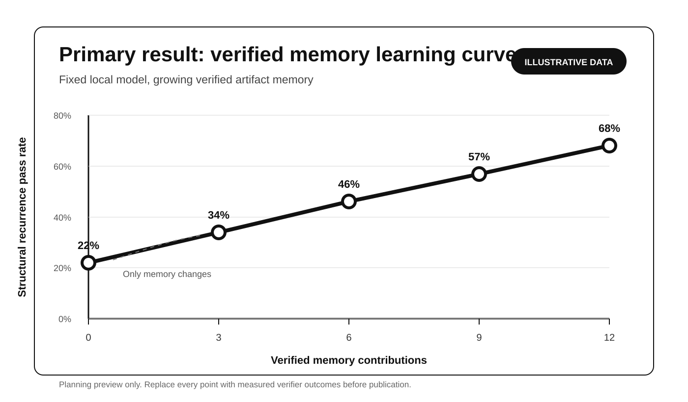

# Terminal Artifact Memory results

**Status:** No teacher/student measured result exists.

The [2026-07-31 measured pilot](2026-07-31-measured-pilot/summary.md) remains intact and visible. Its first local Qwen M0 attempt exceeded the frozen 16,384-token context before executable verification. It produced no scored pair and no memory contribution. It must never be relabeled, repaired, or pooled with the planned teacher/student protocol.

The next planned experiment uses `gpt-5.6-sol` as cloud teacher and sanitized-evidence distiller, and the exact pinned local Qwen model as sole held-out M0/M2 evaluation model. No such measured run has occurred.

## Evidence authority

> **Do not claim success; the executable verifier alone determines whether the run is eligible for local sanitization and later distillation.**

For eligible held-out student tasks, executable-verifier M0/M2 pairs are the sole efficacy evidence. Cloud-teacher build outcomes are memory provenance, never student scores. Model confidence, narrative, apparent tool exits, distillation quality, and learned judges cannot override a verifier result.

Every task must first have a private development-only qualification record covering known-good acceptance, targeted broken controls for every public requirement class, clean-container determinism, and reward/test isolation. Qualification makes a task eligible or ineligible; it is not a measured outcome and cannot prove perfect verifier adequacy.

## What a transfer result requires

A publishable pair must establish:

1. an exact qualified, preregistered held-out task;
2. exact pinned Qwen student model, hash, prompts, runtime, context, and controls;
3. M0 with no retrieved memory;
4. M2 with approved teacher-derived Markdown as the only student-context difference;
5. one executable-verifier result for each condition; and
6. complete role, split, retrieval, memory, and artifact provenance.

Positive transfer means Qwen fails the executable verifier under M0 and passes under M2. A teacher verifier pass means only that its sanitized evidence was eligible for distillation and approval.

## Required reports

1. Frozen teacher, distiller, student, task, runtime, prompt, split, qualification, disclosure, and context manifests.
2. Memory-build provenance from teacher task through verifier, sanitizer, distillation, approval, and page admission.
3. Complete held-out Qwen M0/M2 pair accounting.
4. Positive transfer, negative transfer, stable success, and unresolved counts.
5. Structural recurrence pass rates and memory lift by checkpoint.
6. Retrieval coverage and relevant-page diagnosis.
7. Verified knowledge yield per contribution and searchable byte.
8. Latency, prompt/output tokens, wiki size, and tail behavior.
9. Safety, contamination, qualification, stop, and missing-data accounting.
10. Limitations and operational conclusion.

The analyzer refuses non-measured and incomplete records by default and rejects teacher/distiller scores as efficacy outcomes.

## Illustrative planning figure

Every point in this figure is illustrative. The halted pilot contributes no point, and no teacher/student point exists yet.

## Publication boundary

Commit only reviewed compact results and safe hashes/provenance. Never commit raw benchmark jobs, trajectories, private qualification details, hidden tests, verifier internals, reference solutions, local paths, credentials, canaries, scanner details, model weights, or fabricated measured values.
